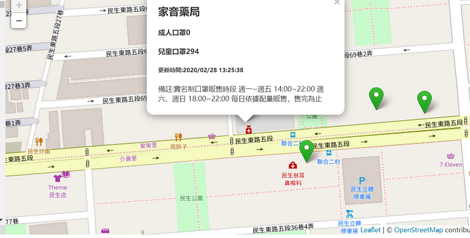

想要快速上手可以參考這篇官方文檔  
[https://leafletjs.com/examples/quick-start/](https://leafletjs.com/examples/quick-start/)

想要快速開發所以用 codepen 寫 搭配 vue.js，採用 cdn 的方式引入 js&css

起手式先在 HTML 裡面新增一個#map

js 的部分先建立 map 容器設置地圖初始的中心點以及縮放倍率

this.map = L.map(‘map’, {  
 center: \[25.033976,121.5623609\],  
 zoom: 16  
 });  
也可以寫成  
var myMap = L.map(‘map’).setView(\[25.033976,121.5623609\], 16);

接下來設置地圖底圖

L.tileLayer(‘[https://{s}.tile.openstreetmap.org/{z}/{x}/{y}.png'](https://%7Bs%7D.tile.openstreetmap.org/%7Bz%7D/%7Bx%7D/%7By%7D.png%27), {  
 attribution: ‘&copy; <a href=”[https://www.openstreetmap.org/copyright](https://www.openstreetmap.org/copyright)">OpenStreetMap</a> contributors’  
}).addTo(this.map);  
{z} 圖磚 zoom 層級 {x} 圖磚 x 座標 {y}圖磚的 y 座標  
設定 opentopomap 為圖磚 也可以選擇 googleMap 但是要收費

然後我滿心歡喜的期待我可以在畫面上看到載入的地圖，但是報告長官...沒有畫面，反覆測試之後，終於發現原因！因為我要用 vue 開發，為了綁定 vue 作用域，新增一個#app，接著把#map 放進#app 裡面，然後地圖就消失了!!??

google 一下發現蠻多人遇到這問題

解決方法就是一定要**幫父容器設置高度** 不然地圖會出不來

#app{height: 100%;}

因為沒用過 fetch 順便練習一下用 fetch 接 api，送出後成功會獲得一個 promise 物件，這時候可以用 json()處理 response，再丟給下一層處理。

先看一下 fetch 的基本用法

fetch(網址)  
.then(res => {  
 // 得到 ReadableStream 的物件  
 return res.json();  
 //最常使用 json(), text()來轉換資料  
}).then(result => {  
 // nextStep  
})catch((err) => {  
 console.log(‘錯誤:’, err);  
});

正式實作

getMaskData(){  
//呼叫前先開啟 loading  
 this.loading = true  
 fetch(this.url).then((response)=>{  
 `return response.json()     }).then((jsonData)=>{     this.loading = false`  
 console.log(‘jsonData’,jsonData)  
 //資料存入 vue data  
 this.dataList = jsonData  
 //繪製圖標  
 this.setMark()  
 })  
 },

預先將 mark 創建好

createMark(){  
 this.greenMark = new L.Icon({  
 iconUrl: ‘[https://cdn.rawgit.com/pointhi/leaflet-color-markers/master/img/marker-icon-2x-green.png'](https://cdn.rawgit.com/pointhi/leaflet-color-markers/master/img/marker-icon-2x-green.png%27),  
 shadowUrl: ‘[https://cdnjs.cloudflare.com/ajax/libs/leaflet/0.7.7/images/marker-shadow.png'](https://cdnjs.cloudflare.com/ajax/libs/leaflet/0.7.7/images/marker-shadow.png%27),  
 iconSize: \[25, 41\],  
 iconAnchor: \[12, 41\],  
 popupAnchor: \[1, -34\],  
 shadowSize: \[41, 41\]  
 })

this.redMark = new L.Icon({  
 iconUrl: ‘[https://cdn.rawgit.com/pointhi/leaflet-color-markers/master/img/marker-icon-2x-red.png'](https://cdn.rawgit.com/pointhi/leaflet-color-markers/master/img/marker-icon-2x-red.png%27),  
 shadowUrl: ‘[https://cdnjs.cloudflare.com/ajax/libs/leaflet/0.7.7/images/marker-shadow.png'](https://cdnjs.cloudflare.com/ajax/libs/leaflet/0.7.7/images/marker-shadow.png%27),  
 iconSize: \[25, 41\],  
 iconAnchor: \[12, 41\],  
 popupAnchor: \[1, -34\],  
 shadowSize: \[41, 41\]  
 });

//詳細用法可參考下列網址

[https://github.com/pointhi/leaflet-color-markers](https://github.com/pointhi/leaflet-color-markers)

如果一次在畫面上繪製數千筆資料，對瀏覽器肯定是一大負擔，因此採用了 MarkerClusterGroup 的套件，在地圖可視範圍內才繪製 mark，也是需要引用對應的 css& js

this.markLayer = new L.MarkerClusterGroup().addTo(this.map)

接下來獲取 api 給的資料，逐一繪出畫面上所有藥局的位置圖標為了搭配資料篩選，預設參數為空陣列時就會顯示所有資料

setMark(arr=\[\]){  
 let data = arr.length == 0 ? this.dataList\[‘features’\] : arr  
 this.showList = data

this.dataList\[‘features’\].forEach((item)=>{  
 let \[x,y\] = item.geometry.coordinates  
 let {name, updated, custom_note, mask_adult, mask_child} = item.properties  
 let marks = item.properties.mask_adult == 0 ? this.redMark : this.greenMark  
 this.markLayer.addLayer(L.marker(\[y,x\],{icon:marks}).bindPopup(\`<h2>${name}</h2>

 <h4>成人口罩${mask\_adult}</h4><h4>兒童口罩${mask\_child}</h4><h5>更新時間:${updated}</h5>
備註:${custom\_note}
  
\`))  
 })  
  this.map.addLayer(this.markLayer)  
 }

抓今日時間的方式為了快速用了

new Date().toLocaleString()

篩選資料的方式 目前只用縣市來做比對

filterData(event){  
 let target = event.target.value  
 let arr = this.dataList\[‘features’\].filter((item)=>{  
 return item.properties.county == target  
 })  
 this.setMark(arr)  
 }

為了效能問題 ，每次繪製新的 mark 前都要先清空 mark 圖層

cleanMarker(){  
 this.map.eachLayer((layer)=>{  
 if(layer instanceof L.Marker){  
 this.map.removeLayer(layer)  
 }  
 })  
 }

附上 codepen 網址

請無視被我放生的 css…

[https://codepen.io/t7552175/pen/qBdraQR](https://codepen.io/t7552175/pen/qBdraQR)
