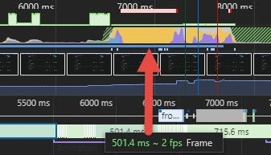

初次使用這個功能，是因為寫了一個動態效果很多的網頁但非常吃效能，年輕不懂事，每秒 create 好幾百個 DOM 在畫面上飛來飛去(好孩子不要學 ，頁面放一陣子就開始卡了，後來比較資深的前輩教我可以用 chrome performance 功能查看。

打開 chrome dev tool 選擇 performance，按下小灰點開始錄製， 按 Stop 停止後，會需要一點時間處理數據後顯示分析圖表。

另外 選擇右上角的小齒輪 Capture Settings ，可以調整一些測試模擬項目  
如果要模擬網路慢的情況可以調整 Network，如果要模擬效能較差的裝置可以調整 CPU，選擇 2x slowdown 代表模擬 CPU 速度慢兩倍。

有時候在電腦上畫面不會卡 ，但是用手機看就非常頓 ，就是因為手機效能不如電腦 ，所以可以靠調整 CPU 這個功能 ，來看看在手機運行上的情形。

**錄製時有幾項建議**

開著無痕分頁去錄製會比較準確 因為有些 google 擴充工具會影響效能，像是 AD block 會去找任何含有疑似廣告的 class ，查找過程中會有點吃效能， 因此錄製出來的結果並不精準。

錄製的時候不要有其他操作， 像是滾動卷軸等等 ，會導致錄的數據不準，可以打開 trello 看板 ，錄製時邊滾動卡片 ，就會發現滾動時特別吃效能。

我覺得這邊有個貼心的地方是有提供逐格影像截圖 ，方便開發者查看哪個階段的畫面特別吃效能。

可以看到畫面上有紫色和黃色的波浪圖，代表著瀏覽器 CPU 的消耗占比，下方會補充紫色， 黃色各代表甚麼意義。

FPS（frames per second）可以說是效能的指標 ，理想的狀況是每秒都有 60fps，就像看動畫一樣 影格越多動作越流暢，可以看到最上面有一條紅色長條代表 FPS 非常低， 因為效能低落的原因 ，導致畫面卡頓不流暢，CPU 也接近滿載。

上圖就是理想的狀況接近 60FPS， 可以看到綠色區塊幾乎是填滿的狀況

接下來來認識一下面板上的資訊個別代表甚麼意思吧!

在面板上我們可以看到很多顏色的色塊 ，在下方的 Summary 面板上， 其實有詳解各種顏色的色塊代表甚麼意思。

- Scripting javaSscript(黃色)
- Rendering 渲染 (紫色)
- Painting 繪製 (綠色)
- Loading 加載 (藍色)
- ldle 閒置 (白色)
- other 灰色 (其他)

上圖可以看到 main 面板上有許多長條狀的色塊 ，色塊越長代表執行時間越長(x 軸) 每一個長條色塊都代表一個事件，然後會發現色塊會向下延升(y 軸)（call stack） 代表事件堆疊，例如 A 事件觸發 B 事件再觸發 C ，一直接連下去，點選色塊後會跑出對應的 Summary ，就可以點進去看是哪隻 function 觸發的。

點進來之後可以看到右邊有一排秒數紀錄，這時就可以找出哪段 code 最花時間。

對了 ，Summary 的 tab 旁邊還有 bottom-up 、call tree 、event log 可以依照自己的需求來看察看數據。

另外也可以開啟即時監測 FPS 面板 ，方便觀察效能。

在 chrome dev tool 中按下 ctrl+shift+P 輸入 show frames per second 就可以了。
