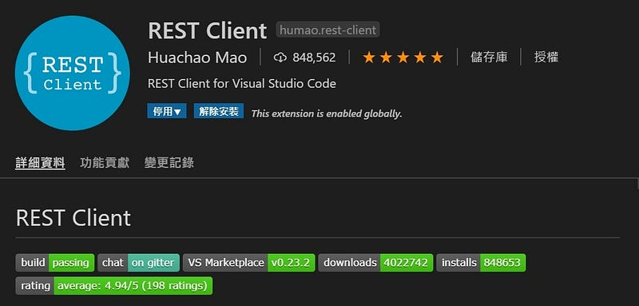

說到測試 api 的工具第一個想到的當然就是 Postman，不過最近發現有一個 vscode pluging 叫做 REST Client 也可以做到同樣的事，而且使用方式也很簡單，推薦大家可以用用看。

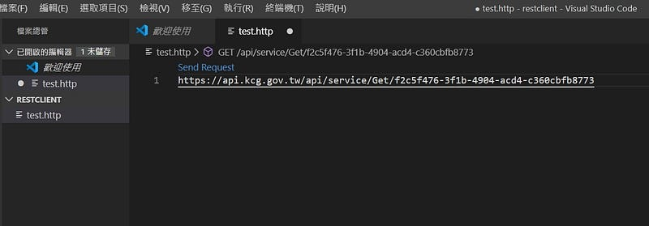

安裝完 REST Client 後先新增一個副檔名為.http 或是.rest 的檔案，然後貼上 api 網址，按下 send request。

ps.網址前方若沒有指定 HTTP Method ，則預設是 GET

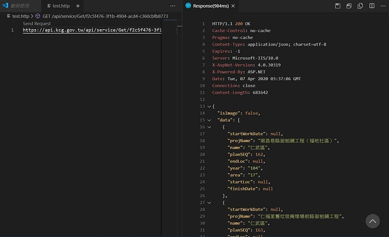

右邊的視窗就會顯示 api 回應的內容，如果資料量比較大會等比較久

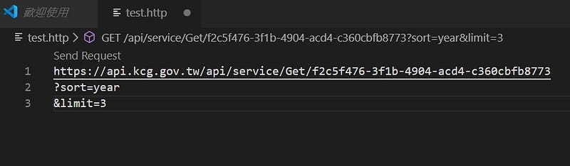

如果想要傳送多個參數也沒問題，用＆連結參數

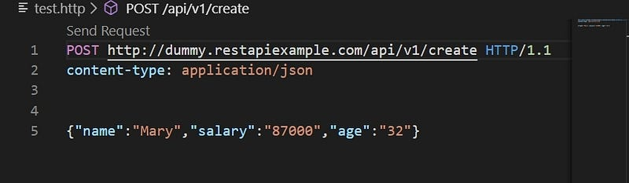

支援 RFC 2616 格式傳送，下方是要傳送的 JSON 資料

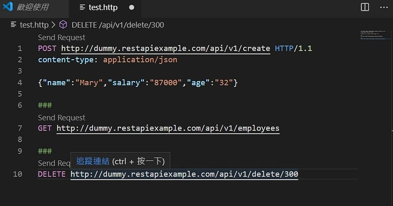

如果有多組 api 需要測試，可以用＃＃＃符號來做間隔

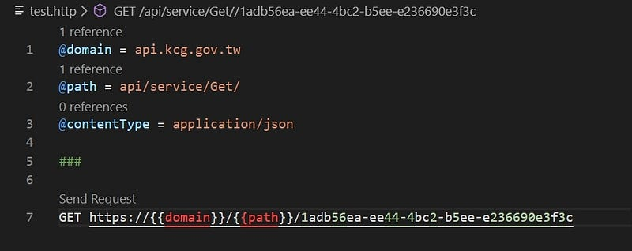

支援變數設定，可以針對不同的開發環境設置環境變數，相當方便

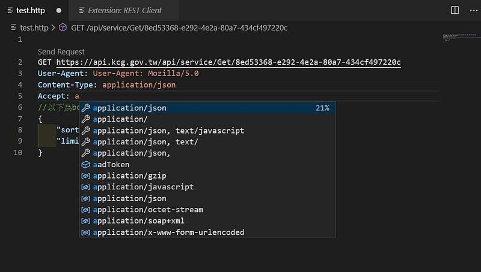

撰寫時都有提示字（懶人福音）

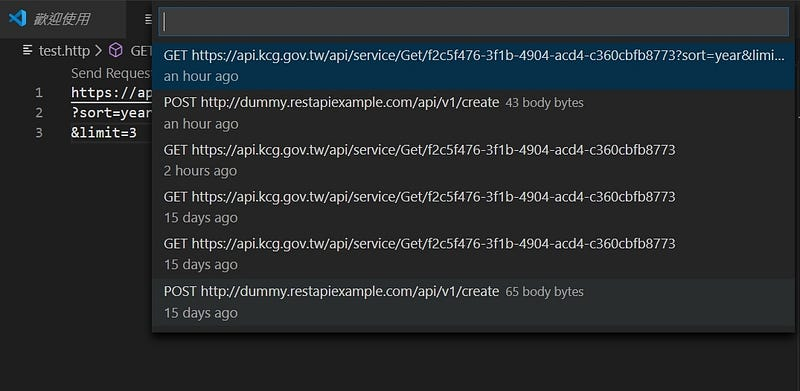

`Ctrl+Alt+H 可以查詢最近五十筆的call api紀錄`

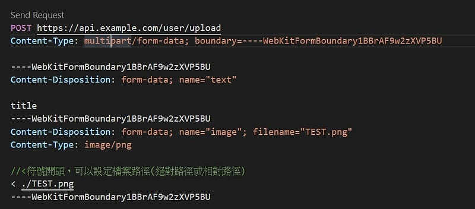

上方是傳送圖片的範例格式，可以利用<來設置傳送檔案的路徑

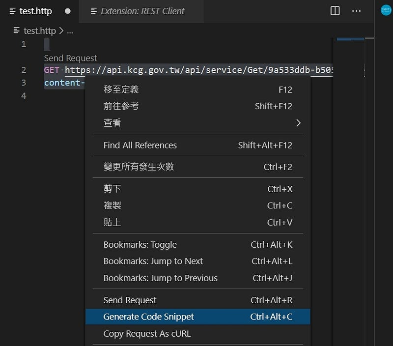

最後介紹一下一個貼心小功能，code snippet!，把網址選起來按下右鍵，選擇 generate code snippet，會出現很多語言可以選，PHP、JAVA、JavaScript 等等，這邊選擇 JavaScript。

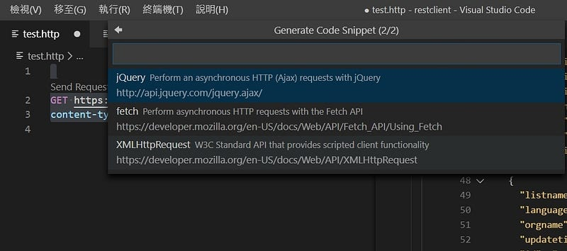

會詢問你要生成哪一種 code snippet，任君挑選！隨便點了一個 fetch 看看

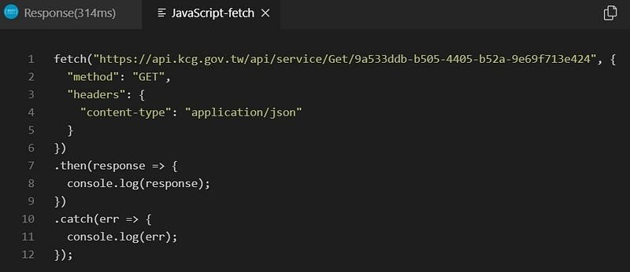

就可以直接拿來用了，只能說真的太貼心了！
