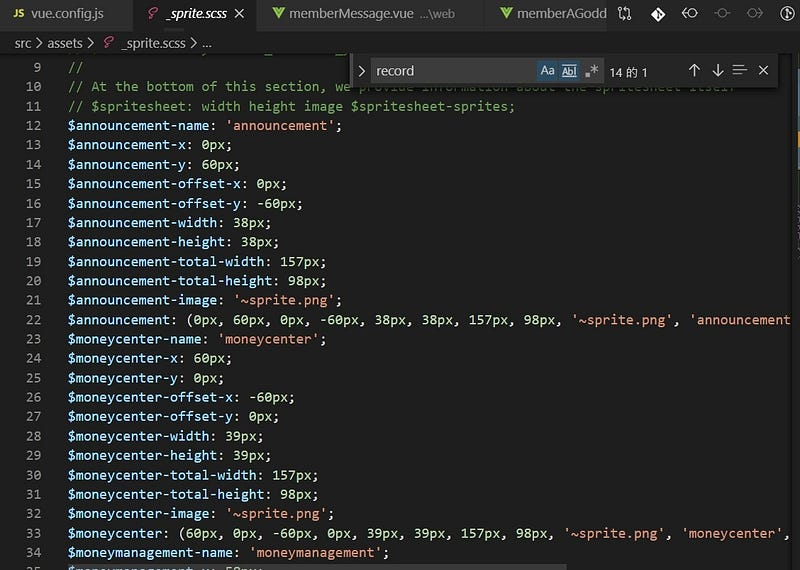
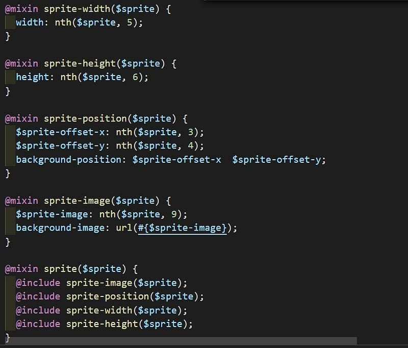
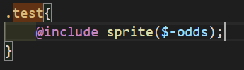

剛踏進前端領域時，前輩建議我可以試試看雪碧圖，恩？雪碧圖？那是什麼東西，簡單來說就是將多張圖片合成一張大圖，減少 http request 次數，本來 30 張小圖片要請求 30 次，現在只要請求一次就大功告成了。

**css sprite 原理**

將多張圖片合併成一張大圖片，再利用 css 的 background-position 定位，就可以指定要顯示哪張小圖（顯示大圖的局部）

在很古早的時期，通常是先用 photoshop 來處理圖片的部分，再用人工的方式來撰寫對應的 css(土法煉鋼），不過如果圖片一直不斷增加，真的會吐血，還好近幾年來多了輔助的工具可以幫助我們處理雪碧圖，compass 或是 gulp 等等都是不錯的選擇，也有線上的網頁可以使用，像是[css sprite generator](https://spritegen.website-performance.org/)。

近期都是用 vue cli + webpack 開發，所以就來介紹如何用 webpack 的套件來製作雪碧圖，首先要先安裝**webpack-spritesmith**

然後在 vue.config.js 設定

```
var path = require('path');var SpritesmithPlugin = require('webpack-spritesmith');
```

configureWebpack: config => {  
 config.resolve.modules = \['node_modules', './src/assets/'\]  
 const Plugins = \[  
 new SpritesmithPlugin({  
 src: {  
 cwd: path.resolve(\_\_dirname, './src/assets/sprite/'),  
 glob: '\*.png'  
 },  
 target: {  
 image: path.resolve(\_\_dirname, './src/assets/sprite.png'),  
 css: path.resolve(\_\_dirname, './src/assets/\_sprite.scss')  
 },  
 apiOptions: {  
 cssImageRef: '~sprite.png'  
 },  
 spritesmithOptions: {  
 padding: 10  
 }  
 })  
 \]  
 config.plugins = \[...config.plugins, ...Plugins\]  
 }

cwd:為圖片素材存放的資料夾

glob:指定來源圖片類型(png、jpg 等等)，如果不限定可以寫成＊

target image :輸出大圖到指定的資料夾

target css: 輸出 scss（css）到指定的資料夾

padding:設定圖片的間隔

apiOptions cssImageRef： scss 參考圖片的位置

下方為輸出的 scss，可以看到用變數的方式來設定圖片的定位




使用方式也很簡單

先在 component @import "@/assets/\_sprite.scss"，然後在對應的 class 底下 include sprite 的 mixin 並帶入圖片名稱（即為變數名稱）就可以了，如果有用過比較古老的 css sprite 都知道還需要設定寬高（設定顯示範圍） ，不然大圖的其他圖片會露出來 ，但 webpack-spritesmith 會自動幫你帶入圖片的 width 和 height ，省下了不少麻煩。



另外要注意， 如果檔案名稱有重複的話 ，生成的變數就會後蓋前。

webpack-spritesmith 也提供了模板的設定 有興趣的人可以閱讀官方文件

雖然 css sprite 的優點不少，但相對的也有他的缺點在，可以看狀況斟酌是否使用。

1.  不適合用於需要自適應的場景（圖片隨著螢幕寬度縮放）
2.  如果圖片需要放大，會有失真問題
