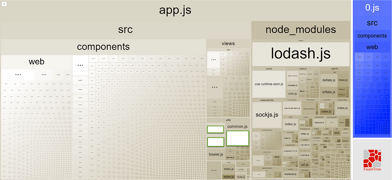
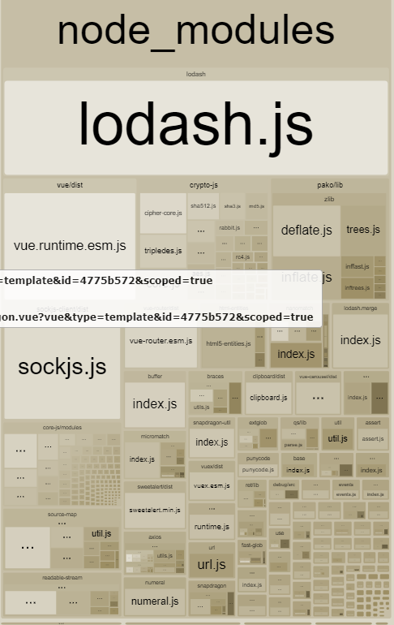
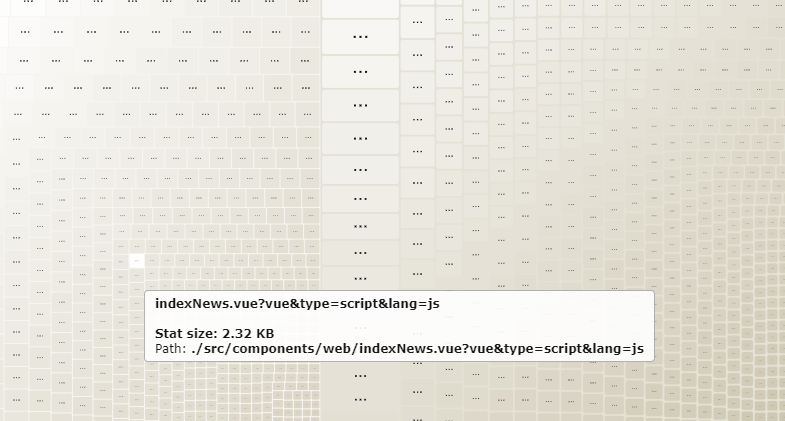

開發專案的時候為了求快速達成效果，就安裝了各式各樣套件來使用，正所謂先求有再求好，當專案開發完畢後，就會開始要求優化載入速度，某天老闆問說為甚麼我們 build 出來的檔案可以這麼巨大?居然有好幾 MB？於是就要想辦法幫檔案瘦身了 ，上網查到 webpack-bundle-analyzer 可以用來分析整個專案裡面的套件、組件大小， 進而抓出到底誰是造成檔案肥大的元凶。(以下的套件用法以 vue cli 3 為例子）

安裝方式 提供了 yarn or npm 的方法

\# NPM  
npm install --save-dev webpack-bundle-analyzer

\# Yarn  
yarn add -D webpack-bundle-analyzer

在 webpack 裡面設定 ，Vue cli 的話就是在 vue.config.js

const BundleAnalyzerPlugin = require('webpack-bundle-analyzer').BundleAnalyzerPlugin;

module.exports = {  
 plugins: \[  
 new BundleAnalyzerPlugin()  
 \]  
}

以 Vue cli 為例，重新 yarn serve 就會看到檔案大小圖表分析了!

因為專案的 component 和套件數量龐大，所以就會看到密密麻麻的小方格， 排在越上方的代表檔案越大，這才發現 loadsh 真的是....超級肥！

大大小小的套件累積起來也是很可觀的，如果為了要減少檔案大小勢必得拔除某些套件或檢查哪些套件根本沒用到，又是另一個痛苦的開始 。

滑鼠移到對應區塊就會出現檔案大小及路徑，一目暸然

補充說明 vue cli 打包後會產生下列的 js

- `vendor.[hash].js` : 第三方套件都會打包在這支 js
- `app.[hash].js` : 開發的程式碼都會打包在這支 js
