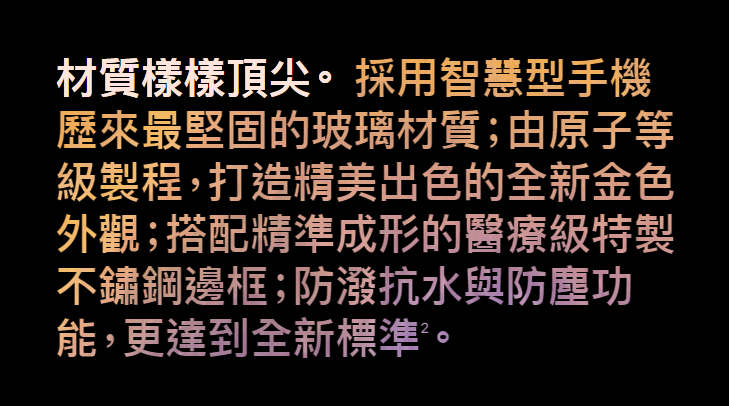
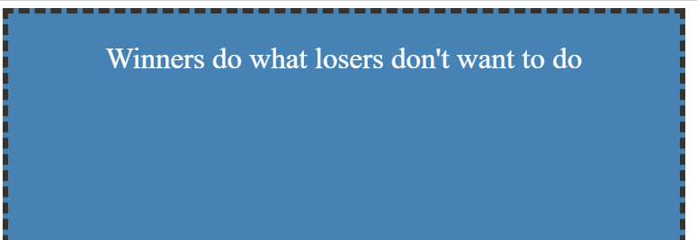
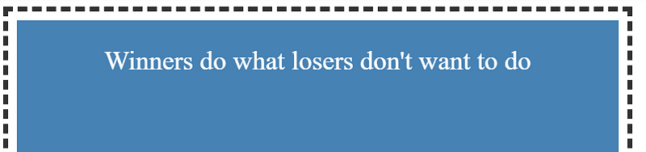
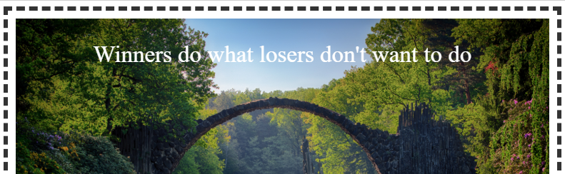
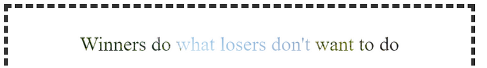

第一次認識這個 css 屬性是在某一年的 apple 發表會，看到了文字居然有漸層效果！ 覺得很酷，看了一下程式碼發現是用了 background-clip：text 屬性，查了一下資料，發現除了 text 還有其他值可以設定，下面就來簡單介紹 background-clip 設定不同值的差異。

- background-clip: border-box;
- background-clip: padding-box;
- background-clip: content-box;
- background-clip: text;

**background-clip: border-box;**  
  背景延伸至 border，此為預設值，基本上設定了看不出差異。

**background-clip: padding-box;**  
背景延伸至 padding，但不會超過 border。

**background-clip: content-box;**

背景延伸到 content，但不會超過 border(p.s 如果沒有設定 padding content-box 與 padding-box; 會看不出差異)

**background-clip: text;**

將區塊内的文字作為裁剪範圍向外裁剪，文字的背景就是區塊的背景，文字之外的區域都會被裁剪掉。需要搭配 color:transparent 使用。

這邊用圖片來做示範 原本的畫面呈現是這樣

用了 background-clip: text 之後

可以看得出來文字吃了圖片的背景

要注意的是，比較舊的 ie 和 firefox 是不支援此屬性的 ，如果要支援這些版本的瀏覽器，就要斟酌使用。
