在 vue 組件中想必大家已經很習慣用 props、emit 來進行組件之間的溝通， 但遇到層級比較深的狀況就會比較困擾，用家族關係來比喻，如果想要傳遞訊息給某個表妹的話，要先傳給父親再傳給阿嬤，阿嬤再傳給姑姑，姑姑再傳給表妹，光聽就累了…有沒有什麼方法可以繞過這些重重關卡直接溝通？就可以利用 vue 的 EventBus 來達成。

範例的結構如下圖，為 index 內各有兩個子 component，並且各自擁有自己的子 component，利用 eventBus 來實作 memberCenterItem 與 customerServiceItem 的組件溝通。

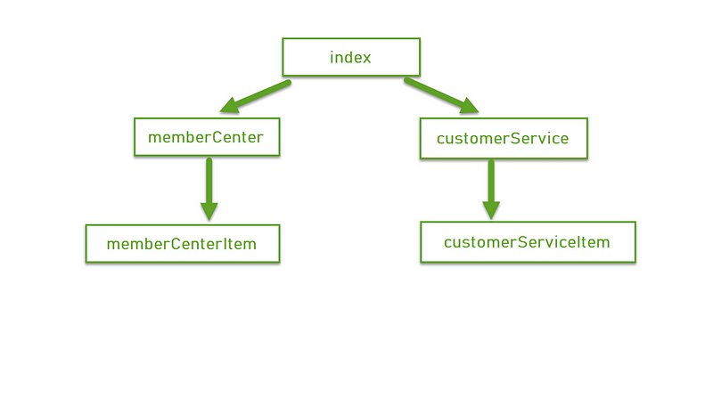

這是 index.vue 的結構

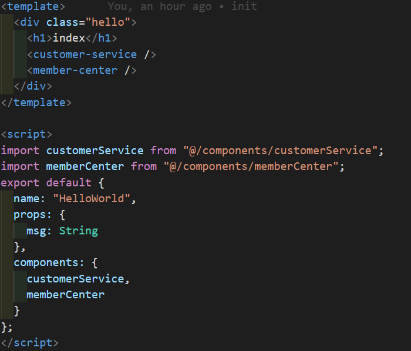

起手式在 src 資料夾底下新增 bus.js（名稱隨意，能夠識別功能即可），在 vue 的原型上掛載一個 vue 實例

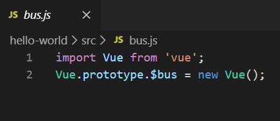

記得要在 main.js 引用 bus.js

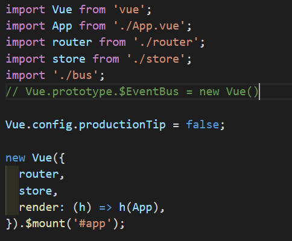

在 memberCenterItem component 裡點擊標題會發送事件，寫法跟原本的 $emit 幾乎一模一樣

this.$bus.$emit('事件',data) //如一般$emit 一樣 可夾帶 data

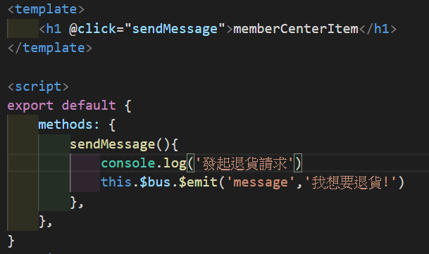

在 customerServiceItem component created 時註冊監聽事件，並且可以拿到另一邊送過來的資料

this.$bus.on('事件',獲取資料後要做的 callback)

備註：避免重複監聽的問題，在組件銷毀之前記得取消監聽

this.$bus.$off('事件')

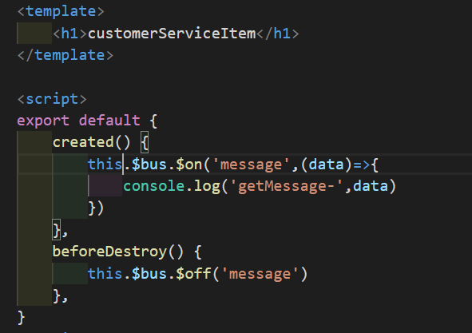

可以看到組件溝通成功！

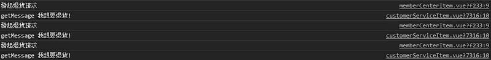

假設不想額外寫一支 js ，也可以直接在 main.js，在 vue 的原型上註冊一個 vue 實例

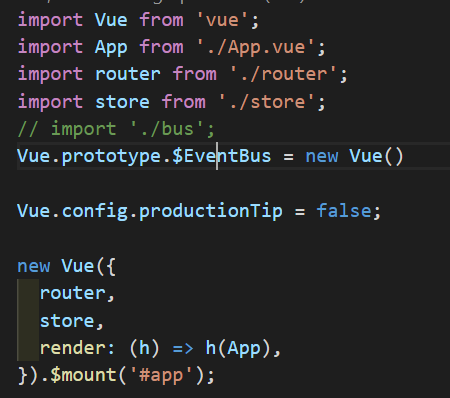

也可以做到一樣的功能

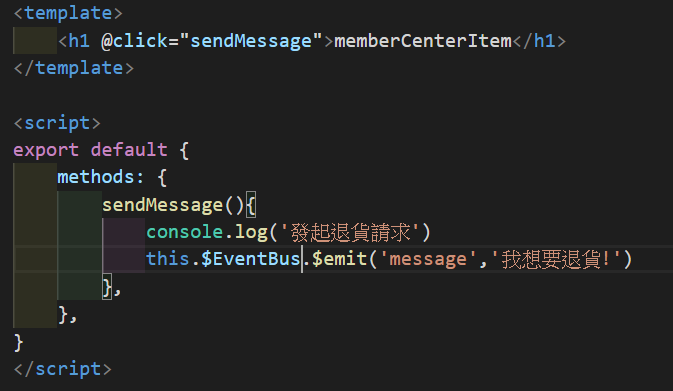
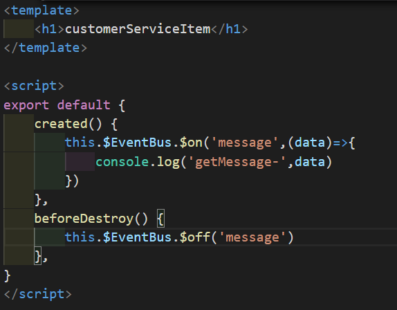

不過我天真的以為監聽事件組件在沒被渲染的情況下，也可以觸發監聽事件，（如同下面的情形）實際測試沒被渲染的組件根本不會經過 created 階段啊..無法綁定監聽事，自然會溝通失敗。

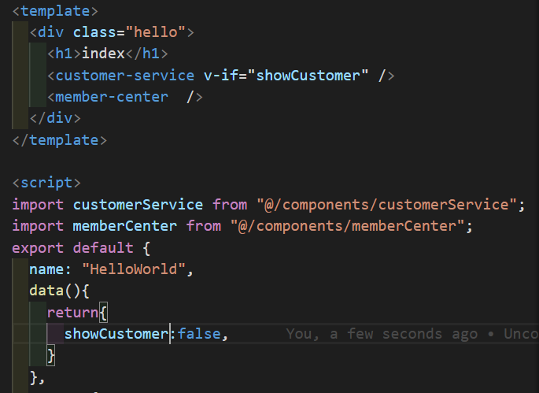
