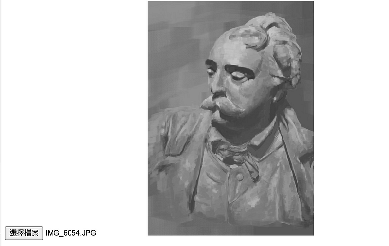
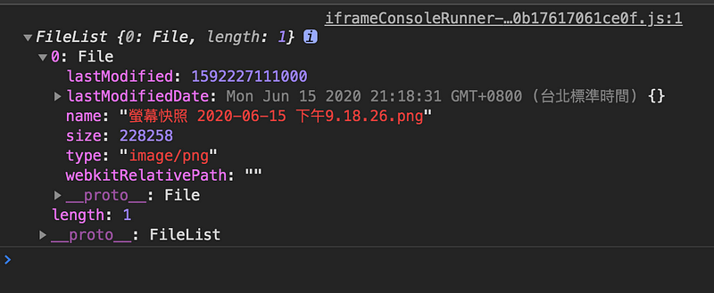
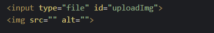
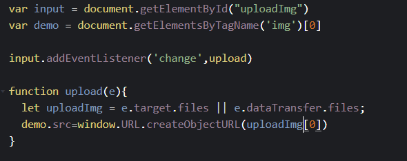
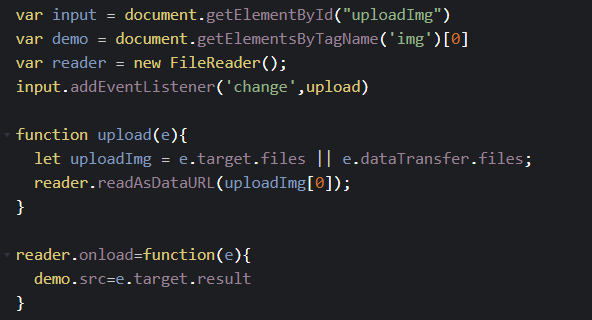

假使用戶上傳圖片，想要預覽上傳的圖片該怎麼做？以前比較古老的方法是先打 api 傳送圖片給後端，後端再回傳圖片 url 給前端接，但這樣一來一往，不但耗費時間，流程也會變得複雜，我們可以利用 HTML5 提供的方法 createObjectURL 和 FileReader 來實作這項功能。

既然提到上傳檔案就一定要先來認識一下 file 物件，以下引用 MDN 的說明

> `File` 物件通常是從使用者於 `<input>` 元素選擇之檔案所回傳的 `FileList` 物件當中取得，也可以來自拖放操作所產生的 `DataTransfer` 物件之中，或是由 `HTMLCanvasElement` 物件（元素物件）執行 `mozGetAsFile()` 方法後回傳。

_FileList 為一個陣列，當 input 為 multiple 時可以存放多個 file，並且帶有各個檔案資訊（例如：檔案名稱、檔案大小、檔案類型等等…)_

下圖為範例實作的 html 結構

- createObjectURL

URL.createObjectURL()方法會根據傳入的 file 物件生成一個的 URL

在 input 上綁定監聽事件，偵測檔案有變化就觸發 upload function，用 e.target.files 來獲取 FileList，由於這個 input 只能上傳單一檔案，所以 FileList 陣列中只有一筆資料，取陣列第 0 筆資料傳入 createObjectURL，就會生成對應的檔案連結，再指定圖片來源，就大功告成了！如果不再需要使用該對象，可以在圖片 onload 的時候利用 URL.revokeObjectURL()來釋放記憶體。

- FileReader

非同步存取與讀取電腦中的內容

這個是利用 FileReader 來實現圖片預覽功能，readAsDataURL 讀取完 files 之後回輸出 base64 編碼字串，再將圖片連結指定給 img source。

以上的方法都是將圖片暫存在瀏覽器的記憶體裡面，關閉網頁後就會釋放記憶體，我在 stackoverflow 上面查到兩者相比之下，createObjectURL 的效能會好一些些，前提是使用完後要記得用 revokeObjectURL()釋放記憶體。
