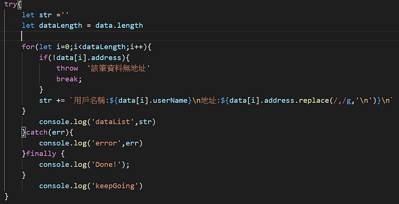

第一次接觸 try catch 是在剛學 PHP 的時候 ，雖然現在都還給老師就是了…我們可以利用 try catch 來捕捉例外的狀況，也可以因應不同錯誤狀況，拋出不一樣的錯誤訊息。

今天就舉例一下工作上什麼樣的情境會用到 try catch，假設有段程式碼是在處理後端回傳的資料 ，但有機率性的這隻 API 並不會像我們預期的那樣回傳正確的資料格式，以我曾經遇到的狀況是陣列裡面有數十個物件，但有幾個物件少了 Key，這樣描述聽起來有些抽象，直接看資料應該會比較清楚。

假設我想要針對每筆資料的 address 做簡單處理(用換行字符取代逗號)，程式碼如下圖

但如果不幸的 api 回傳的資料剛好是有問題的，你有會看到以下的畫面，因為 Amy 這筆資料沒有 address 的 key ，所以取其值就會是 undefined，並不具有 replace 這個方法。

這時就可以用 try catch 來預防這樣的情況，try 區塊放的程式碼是你預期可能會出錯的地方，可以針對不同的狀況，用 throw 拋出不同的錯誤訊息，如果在執行時發生錯誤就會拋出錯誤給 catch 並且印出錯誤訊息，補充一下無論是否在 try 的部分拋出錯誤， finally 都會執行。

**try(no error) 》finally**

**try(error) 》 catch 》finally**

假設沒有 throw error message，那麼 catch 中的 error 就會是瀏覽器預設的錯誤訊息。

在工作實務上，比較常用的使用情境是在預防某些錯誤會中斷整個流程，用了 try catch 之後捕捉到錯誤的同時，也會繼續執行接下來的程式碼，確保不會影響其他程式碼執行。
