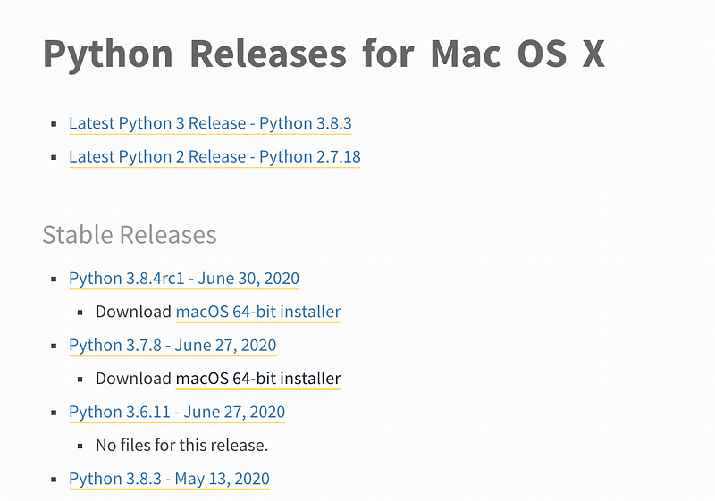
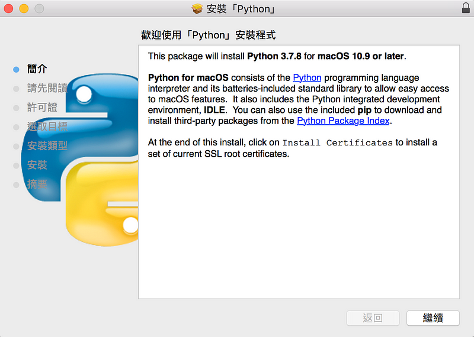
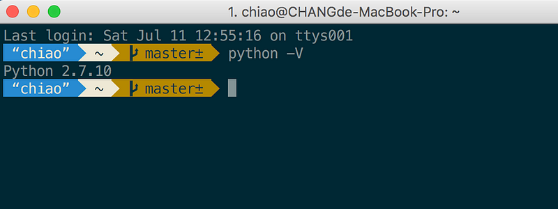
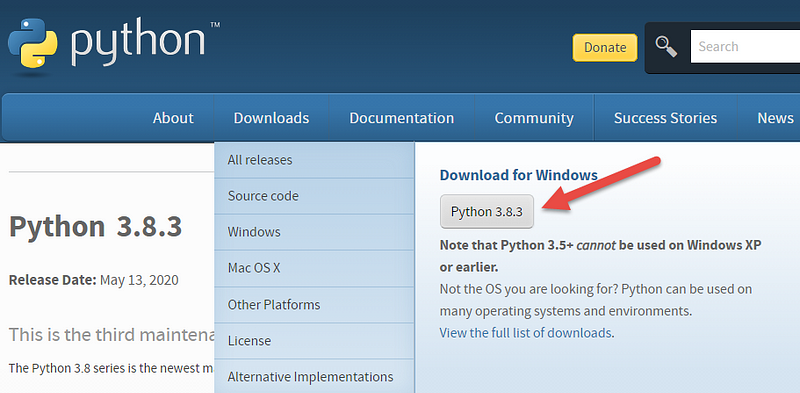
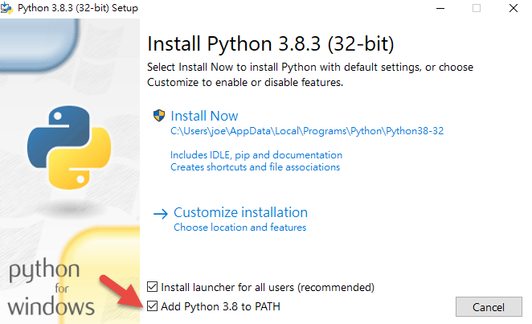
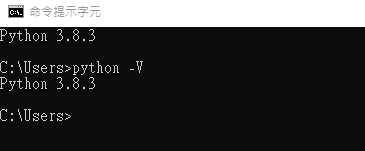
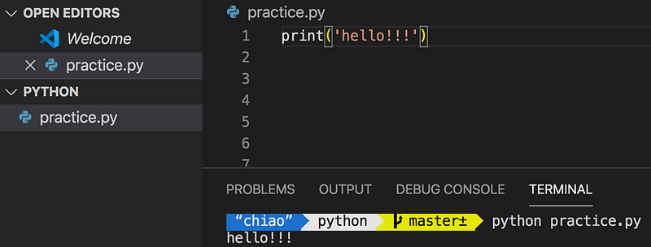

有鑒於最近周圍的人都在學 python 我也來跟風一下好了（誤），不得不說 python 的語法還蠻好上手的，而且用途也廣泛，爬蟲、自動化等等都會用到，好 python，不學嗎？

那麼就從安裝開始，先到 python 官網下載安裝檔，選擇 3 開頭的穩定版本就對了，因為 python3 支援較新的語法，沒理由不選新的！

快樂安裝中..

然後打開終端機，輸入 python -V 檢查是否安裝成功    
mac 某幾代的 OS 都有預先裝好 python 2.x 的版本 (我的 mac 版本為 10.2

恩？好像哪裡怪怪的？我明明安裝的是 3 的版本怎麼變 2 了？後來不管我重新安裝還是想透過 homebrew 下載安裝檔都失敗… orz

借室友的 windows 筆電來試裝看看

結果 windows 安裝過程五分鐘搞定…mac 搞了老半天依然無解的停在 2 的版本，如果有知道怎麼升級的前輩再麻煩跟我說了…

因為我比較熟悉 js，所以有些在學習的過程中，就會拿 js 跟 python 作比較

先新增一個副檔名為 py 的檔案 ，然後在 terminal 執行 python xxx.py 就可以了

宣告變數的方式也很簡單

a = 123

python 的資料型態一樣有字串、布林值、 數字等等…

數字有提供這些運算方法

a = 10

b = 3

print(a + b)

print(a - b)

print(a \* b)

print(a / b)

print(a % b)

print(a \*\* b)

#輸出

13  
7  
30  
3  
1  
1000

字串的組合方法

str1 = 'hey!' + 'yo'  
str2 = 'hey!' 'yo'

print(str)  
print(str2)

#輸出  
hey!yo  
hey!yo

不過不像 js ，可以允許數字＋字串這樣的操作，會報錯

a = '520'

b = 5566

print(a + b)

#會輸出

Traceback (most recent call last):  
 File "practice.py", line 42, in <module>  
 print(a + b)  
TypeError: cannot concatenate 'str' and 'int' objects

所以需要自己轉換型別

a = '520'

b = 5566

print(int(a) + b)

print(a + str(b))  
//輸出

6086  
5205566

支援多行文字，利用三個雙引號就可以達成

str = """hey!

!!!!!

yo"""

print(str)

#輸出  
hey!  
!!!!!  
yo

重複字串（不得不說這真的蠻酷的

str = 'song la '\*3

print(str)

#輸出  
song la song la song la

取得字串，類似 js substring

str = 'where'

print(str\[1:4\])

#輸出  
here

print(str\[1:\]) #從 index1 取到最後一位

#輸出  
here

print(str\[:4\]) #從字首取到 index4 前一位

#輸出  
wher

**list 列表**

是可以異動的，跟陣列蠻相似的，index 也是從 0 開始

list = \['amy','dabbie','john','tom','tina'\]

print(list\[0\])

#輸出  
'amy'

可以利用 index 來異動資料

list = \['amy','dabbie','john','tom','tina'\]

list\[0\] = 'bay'

print(list)

#輸出  
\['bay', 'dabbie', 'john', 'tom', 'tina'\]

與字串相同 可以用\[?:?\]來取得元素

list = \['amy','dabbie','john','tom','tina'\]

print(list\[2:4\])

#輸出  
\['john', 'tom'\]

也可以用來清空資料

list = \['amy','dabbie','john','tom','tina'\]

list\[2:4\] = \[\] //刪除 index2 到 4(不包含 4)的項目

print(list)

#輸出 \['amy', 'dabbie', 'tina'\]

組合 list，類似 js concat，可以將兩個 list 合併為一個

list = \['amy','dabbie','john','tom','tina'\]

list = list + \['frank','vicky'\]

print(list)  
//輸出  
\['amy', 'dabbie', 'john', 'tom', 'tina', 'frank', 'vicky'\]

取得 list 長度

list = \['amy','dabbie','john','tom','tina'\]

length = len(list)  
print(length)

//輸出 5

巢狀的 list 二維陣列

list = \[\['amy','dabbie'\],\['john','tom','tina'\]\]

print(list\[0\]\[1\])  
//輸出 dabbie

list\[1\]\[0:2\]= \['ray','petter'\]  
print(list)

//輸出  
\[\['amy', 'dabbie'\], \['ray', 'petter', 'tina'\]\]

**tuple 固定列表**

有順序，**不可變動**的資料集合，如果做了異動會報錯

list = (9,9,6)

list\[2\] = 7

print(list)

#輸出  
Traceback (most recent call last):  
 File "practice.py", line 94, in <module>  
 list\[2\] = 7  
TypeError: 'tuple' object does not support item assignment

以上是對於 python 的型別的介紹，希望我可以快點搞定 mac 環境，不然不能用新語法很痛苦啊…
