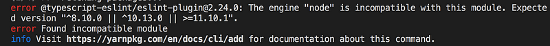
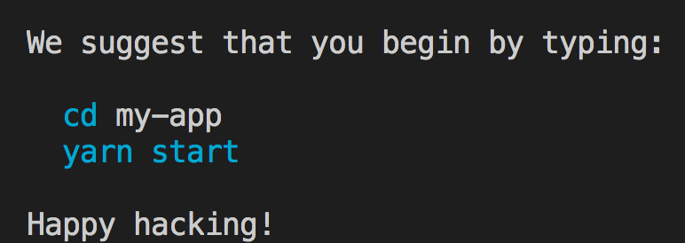
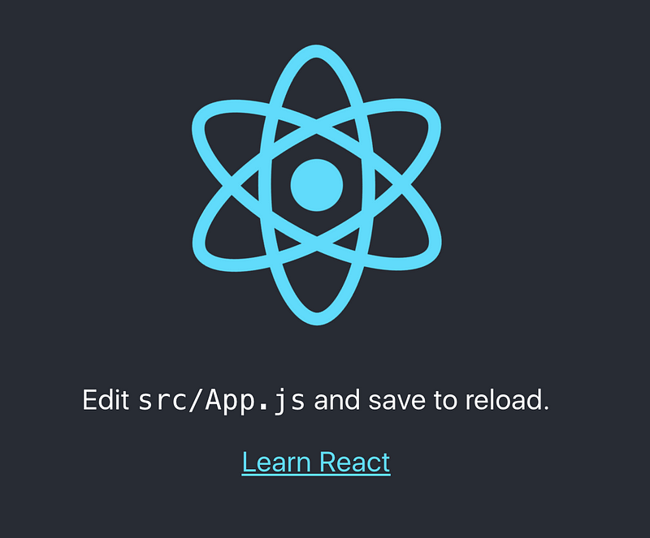
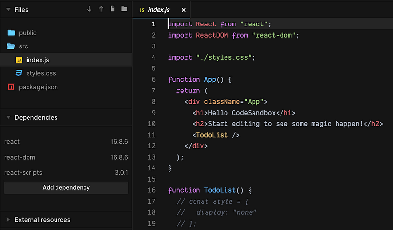
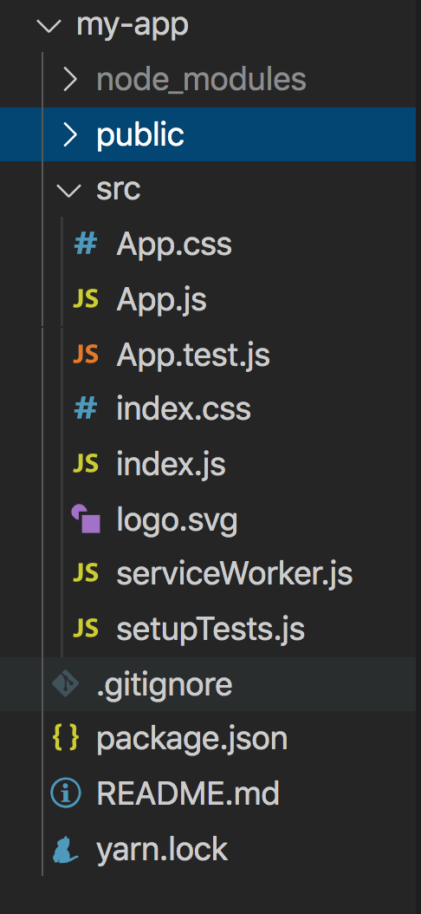
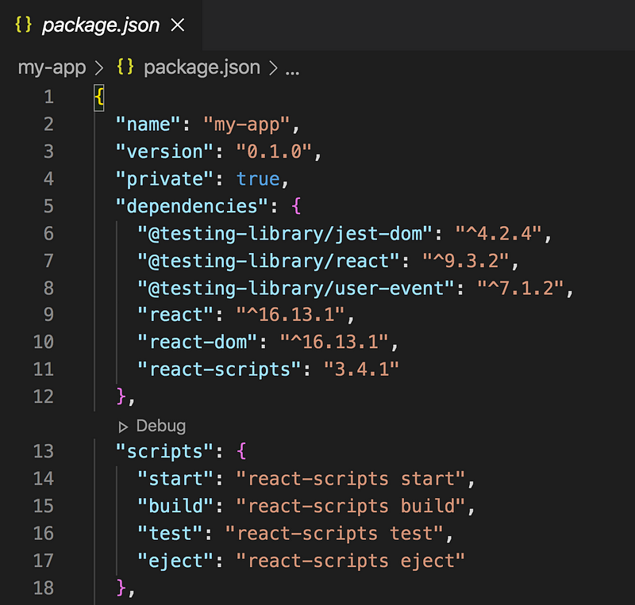
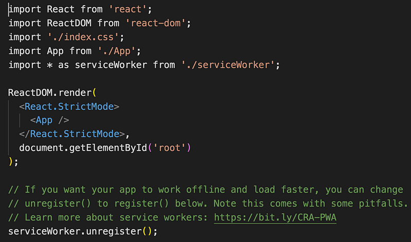
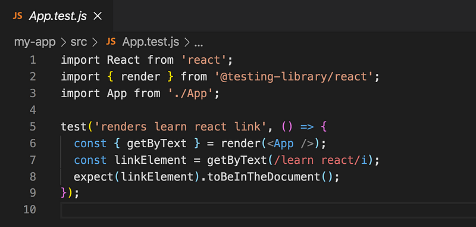
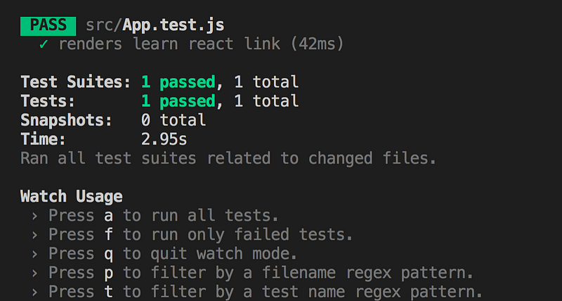
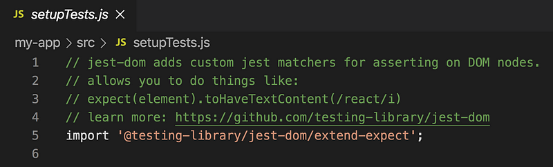

#### 為什麼要學 React?

打開求職網站發現不少公司都是要求會前端三大框架，不知不覺已經成為標準配備了，好多公司都用 React ，不愧是前端框架市佔率最高的！假設學會了 React，對於找工作這件事應該是有一點點幫助的。

除了這個現實的理由，也是因為目前公司的專案都是用 vue 開發 ，基本上沒什麼機會碰 React，好奇 React 跟 vue 有什麼樣的差異 ，以及學習過 vue 之後，碰 react 的學習曲線是否沒有那麼陡峭了？(想當初 vue 都不會，就碰 angular，就像誤入狼群的小綿羊啊…）

畢竟從沒寫過 react，所以接下來的學習筆記會是參考 react 官方的 tutorial 和用 react 關鍵字去估狗到的一些關鍵字去延伸拼湊出一個學習脈絡，可能就會是沒那麼系統性的（隨興）

寫過 vue 發現，雖然框架提供了很多語法糖，但是對於原生 js 的熟悉度和一些基本觀念還是很重要的，這點在 react 應該更能體會，因為沒什麼語法糖，所以對 js 不熟悉的話，應該會覺得很有難度，希望我撐得住 XD

根據以往學習一個框架的經驗，就是會遇到很多自己沒預期到的錯誤或是踩到一些雷，到時候也會一併的記錄下來。

**react 的特點**

- 支援 ie8
- 元件化的設計，可以將 ui 拆分的更細，重複性使用
- 強大的生態圈
- 利用 Virtual DOM 來提升效能

#### React 建置開發環境

react 可以手動建立環境，或是自己寫 webpack 設定，安裝相關的套件，身為初學者的我為了比較快速上手（懶），決定採用官方提供的 create-react-app 來快速創建開發環境。

在這之前我們必須先安裝 node.js ，選擇 lts 穩定版本，如果已經安裝過了，要確認 node 版本要 ≥8.10 且 npm≥ 5.6 ，不然就會像我一樣，打開 vscode 的 command line 下了 npx create-react-app my-app，結果就跳了這個錯誤，node 版本過舊，沒關係就更新看看



> [Node](https://nodejs.org/) (或者說*Node.js*) 是一個開源、跨平台和允許開發者使用[Javascript](https://developer.mozilla.org/en-US/docs/Glossary/JavaScript)創造伺服器端工具和應用的執行環境。運行的目的是為了能在瀏覽器外使用，例如：直接執行在電腦或伺服器上。所以該環境捨棄了瀏覽器限定的 JavaScript APIs 並增加更多傳統 OS APIs 的支援，例如：HTTP 和檔案系統的程式庫。

> npx 是 npm 內建的一個指令，安裝完畢後就會把安裝檔刪除，不佔空間，可以指定套件版本。

利用 npm install -g npm 來更新，如果是 mac 記得前面加 sudo 不然會權限不足，想不到我更新到 10.6.0 依然失敗，估狗一下發現蠻多人遇到這個問題的，都說升級就好了，但我升級就是沒用啊…想說不然就裝 nvm 來安裝指定版本 node 好了，結果 nvm 也安裝失敗，或許是我電腦的 mac os 作業系統太老舊的關係 orz

安裝如此不順利，沒關係！坎坷本來就是工程師的日常，折騰老半天最後查到 yarn config set ignore-engines true，就成功安裝了，當然我目前還不知道忽略套件的版本檢查會有什麼副作用…



不過奇怪的是明明我就是用 npm 安裝的，卻是用 yarn 起專案？不知道是否跟我之前有安裝過 yarn 有關，還是目前預設都是用 yarn 了?，實際測試 npm start 或 yarn start 都可以成功讓專案跑起來，不過 yarn 的速度快很多

> yarn 是一套套件安裝管理工具，速度比 npm 更快，語法更加簡潔

下了 yarn start ，就成功 run 起專案了，用網頁打開 localhost:3000 就可以看到以下畫面



順帶一提，因為 React Hot Loader 的關係，修改完 js 後存擋，畫面就會自動刷新

另外，也可以利用線上的開發工具 codesendbox 來開發，可以依照自己的需求選擇需要的套件，方便做一些簡單的練習



整體而言，react cli 跟 vue cli 搭建出來結構蠻相似的，但 src 底下多了幾個我比較好奇的檔案，接下來就會來介紹這些檔案的用途是什麼

#### React create react app 資料夾結構



- package.json 記錄專案用的套件(dependencies)以及開發與打包用的指令（scripts）



- .gitignore 紀錄 git 要忽略的檔案 ，通常 node_module 不會加入版控內
- node_module 資料夾底下存放專案會用到的套件
- public 底下存放靜態資源檔，和一個透過 js 渲染出畫面的 index.html
- manifest.js 設定 pwa 的時候 可以用來設定顯示在手機主畫面的 icon 和一些樣式設定

> PWA（Progressive Web App) 簡單來說就是可以讓網頁變成一個 app 應用程式，也支援離線瀏覽，看起來就像原生的 app 一樣

- src 底下放的通常是開發的檔案(組件）
- index.js 網頁進入點的第一支 js（入口 js）， 這邊會寫初始渲染的對象和要綁定的 dom

等同於 vue cli 中的 main js



- App.js 為初始畫面的 ui 介面
- App.test.js，測試 app.js 專用 ，jest 在測試的時候，會找尋副檔名為 test.js 的檔案

> jest 為測試 javascript 的框架，可以用來實現前端自動化測試



執行 yarn test 就會開始跑測試，看是否通過檢核，也會顯示測試了哪些檔案以及測試結果



setupTest.js 看起來是在設定單元測試的配置 (但這塊我不熟



serviceWorker.js 用來實現 pwa 功能中可以離線瀏覽的功能

那這時應該會出現一個疑問，那麼 babel 和 webpack 的設定呢？怎麼沒看到類似相關的設定檔？

其實都已經預先設定好了，只是隱藏起來，讓你省去不少力氣能專注在開發程式碼上，那假設我想要修改 webpack 的設定呢？

```
npm run eject
```

執行`eject`之後，就可以看到 webpack.config.js 了，可以自由擴充功能
