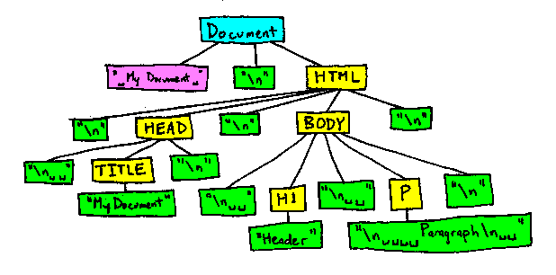
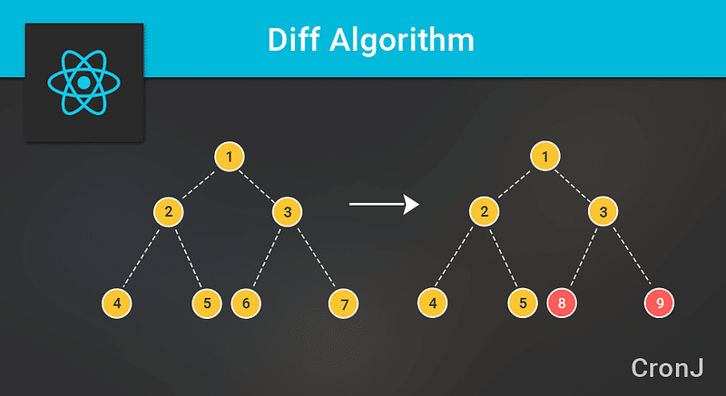

會特別寫這篇的原因是以前學習框架的時候只學語法而不懂原理，如果被問到使用框架有什麼好處可能也回答不太出來，由於 React 是透過 Virtual DOM 來提升網頁渲染的效率，所以今天要來探討 Virtual DOM 的運作原理，在了解 Virtual DOM 之前先來了解什麼是 DOM 吧！

#### DOM 是什麼？

> **文件物件模型（_Document Object Model, DOM_）**是 HTML、XML 和 SVG 文件的程式介面。它提供了一個文件（樹）的結構化表示法，並定義讓程式可以存取並改變文件架構、風格和內容的方法。(擷取 MDN 的部分說明

由下圖可以知道 DOM 是樹狀結構從 document 根結點向下延伸，下面依附了許多子節點



我們很常利用 js 來操作 DOM， 當瀏覽器在更新畫面的時候會觸發 replaint（回流） 以及 reflow（重繪）這兩個更新機制

#### repaint

> 畫面元素更換樣式時候就觸發（background-color、color…

#### reflow

> 更改畫面的佈局(結構排列)就會觸發（更改視窗大小，操作 css 屬性：position、width、height…

頻繁操作 DOM 其實相當吃瀏覽器資源，導致效能低落，這就是為甚麼我們需要 vitural DOM，要修改一個子節點就要重新繪製整個 DOM 聽起來就很不智慧，所以就要借助 Virtual DOM 的演算法，就可以只更新需要異動的部分。

#### Virtual DOM 的流程

1.  初次使用`setState()`方法的時候，React 會先複製一份 dom 的物件（即為 Virtual DOM

2\. 當 React component 的 state 改變時，會比對先前的 Virtual DOM 和當前的 Virtual DOM 差異，稱之為 diff 運算

3\. Virtual DOM 先用自己的演算法(diff)算出實際需要更新的部分，比對兩者差異之後，再去更動真實的 DOM，有效減少渲染的次數 ，提高效能

這是一般的 html 結構

<div id="header">    
    <h1 class="title">Apple</h1>  
    <p class="content">lemon</p>   
</div>

這是 Virtual DOM 的結構，是 JavaScript 模擬出來的物件， 會以以下的格式儲存起來

{  
 tag: "div",  
 props: {  
 id: "header"  
 },  
 children: \[  
 {  
 tag: "h1",  
 props: { className: "title" },  
 children: \["Apple"\]  
 }, {  
 tag: "p",  
 props: { className: "content" },  
 children: \["lemon"\]  
 }  
 \]  
}

- type: DOM 標籤名稱
- props:DOM 屬性
- children:DOM 子元素

下方就用程式碼來稍微模擬一下 Virtual DOM 的執行過程

1.  createELement :先使用 Virtual DOM 提供的 createELement 方法來生成真實的 DOM

```
var count = 0;    var tree = render(count);               var rootNode = createElement(tree);     document.body.appendChild(rootNode);
```

2.當 count 變動時 Virtual DOM 進行比對 再將差異 patch 到實際的 DOM

```
count++
```

```
var newTree = render(count);var patches = diff(tree, newTree);rootNode = patch(rootNode, patches);tree = newTree;
```

> 什麼是 patch？patch 指的是在原有的 DOM 結構上做異動

#### 關於 diff 演算法



傳統的 diff 演算法複雜度為 O(n³) 處理 100 個節點就要進行 100 萬次的比對，Virtual DOM 的 diff 演算法為 O(n) 與傳統的差異在於下幾點：

1.Virtual DOM 只會比較同一層級的節點

2.同一層的節點為了識別個別具有唯一的 key，為了避免節點只是移動又被重新創建一次

3.如果發現節點不見了其子節點也會一併刪除，不會做進一步的比對

以往如果是手動操作，每操作一次就會更新一次 DOM，如果是透過 react setState 就會是將多個操作合併為一次的操作，避免頻繁更新頁面，因此開發者只要專注在資料邏輯上，畫面的更新機制全部交給 React 處理即可。

參考資料

diff-algorithm-implemented-reactjs
