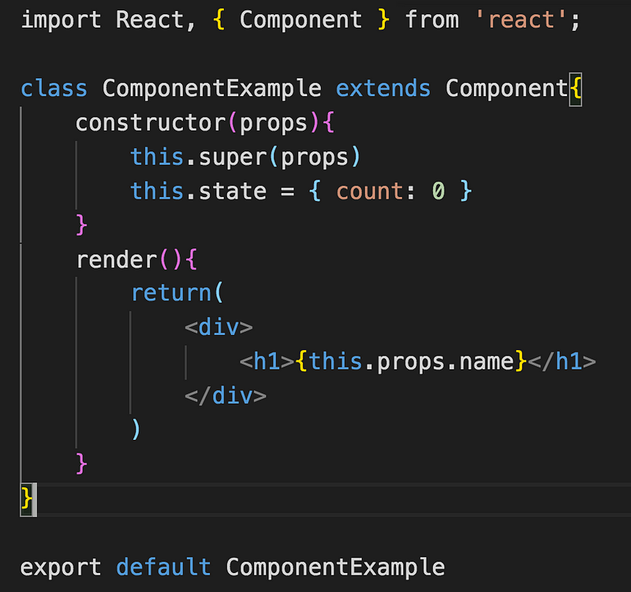
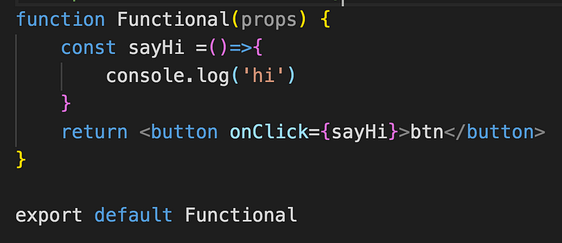
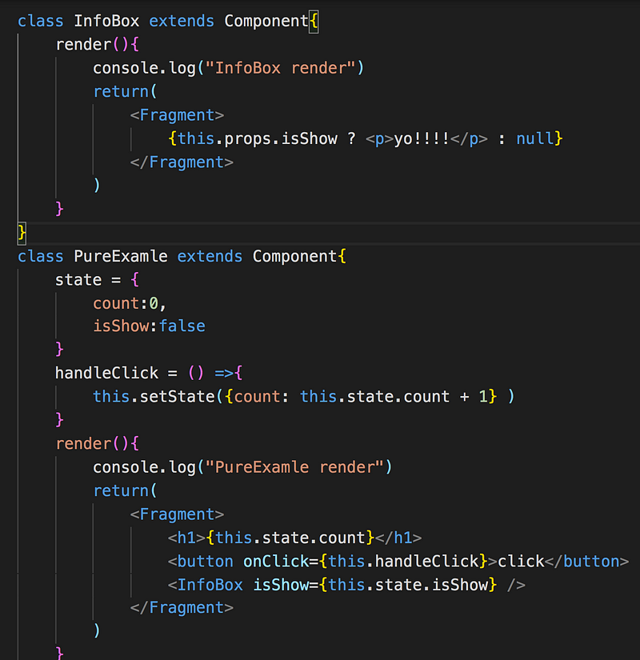
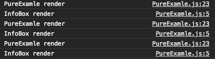
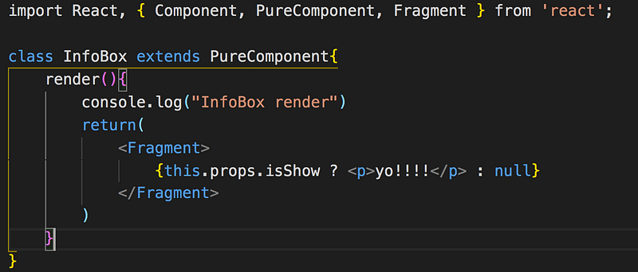

Component 的概念就很像一塊塊積木，可以拼湊組成城堡或是飛船之類的，Component 裡頭會回傳 React element，透過這些 Component 就可以組成網頁的 UI 畫面，可以依照需求來切分不同功能的 Component，一個 Component 結構可以很簡單，裡面甚至只有一個按鈕，這時候就會有個疑問？拆分的這麼細有什麼好處嗎？最大的好處就是相似的結構可以抽離出來重複使用，不需要重複的邏輯寫好多遍，也方便維護，有了 Component 就可以解決以下的問題

**情境一**

_傳統的寫法為每個頁面都有一個 header，假設網頁的 header 需要改動，就要打開每個頁面 header 調整，真的會吐血.._

**情境二**

_a 頁面、b 頁面、c 頁面都需要這個按鈕，然後功能還一模一樣，重複的東西居然要寫三遍…_

Component 會定義這個組件的結構樣式等等，再透過外部傳進的資料，根據資料的變化，來更動 UI 畫面，不需要像傳統那樣手動更新

React Component 的有兩種寫法 Class Component 以及 Functional Component，今天先來介紹 Class component，利用 [ES6 Class](https://www.fooish.com/javascript/ES6/class.html)的語法來創建 Class Component，既然提到了 Class 就花點時間稍微簡介一下 Class 有哪些方法吧！

**constructor 建構式**

在 Class 物件被建立時會呼叫一次，物件的屬性會在這裡做定義，這裡也可以帶入不同的參數來建立不同的類別，那可以不寫嗎？答案是可以的，沒寫也會預設幫你創建 constructor

class Bird{  
 constructor(name){  
 this.name = name  
 }  
}

const bird1 = new Bird('kerry')  
const bird2 = new Bird('bay')

**extends 繼承**

先宣告一個父類別(鳥類），並且一定義一個飛行的函式，接者子類別（老鷹）繼承父類別，就可以使用父類別定義的方法。

class Bird{  
 fly(){  
 console.log('fly')

}  
}

class Eagle{

}

const eagle = new Eagle()  
eagle.fly() // 印出 fly

假如子類別定義了與父類別相同的函式名稱，那麼子類別的函式就會取代父類別的函式

class Bird{  
 fly(){  
 console.log('Birdfly')

}  
}

class Eagle{  
 fly(){  
 console.log('Eaglefly')

}  
}

const eagle = new Eagle()  
eagle.fly() // Eaglefly

那假設我想要在子類別的呼叫父類別的方法可以嗎？就是 super()登場的時候了，為了可以取得父類別的屬性或是方法會在 constructor 呼叫 super()方法，這麼一來子類別不需要重寫一遍 this.name = name，只要 super(name)即可，利用 super.函式名稱就可以呼叫父類別的方法。

class Bird{  
 constructor(name){  
 this.name = name  
 }  
 fly(){  
 console.log('Birdfly')  
 }  
}

class Eagle{  
 constructor(name){  
 super(name)  
 }

fly(){  
 super.fly()  
 console.log('Eaglefly')

}  
}

const eagle = new Eagle()  
eagle.fly() // 輸出 Birdfly Eaglefly

**靜態方法 static**

屬於 class 的屬性或方法，不需要實例化，就能以 class 名稱.方法來呼叫

class Bird(){  
 static diss(name){  
 console.log('diss ' + name )

}  
}

Bird.diss('mel') //輸出 diss mel

const bird = new Bird()  
bird.diss('mel) //bird.diss is not a function

了解了 Class 類別之後就可以來創建 React Component

要先 import React Component

然後宣告一個 Class，記得命名要跟檔名一致，第一個字都為大寫，並且繼承 React Component

constructor() 方法，必須先執行 super()，才能取得 this，會在這裡設定 state 的初始值，在參考範例的時候，我發現了一件事，為什麼有的範例有寫 super(props)，有的沒有呢？ 而且沒寫的話在 render 也可以取到 this.props，查了資料原來不管有沒有寫 super(props)，在 render 階段都可以用 this.props，剛好在爬文的時候看到有網友分享有沒有加 super(props)的差異，個人覺得蠻清楚的

什麼都沒寫的

constructor() {  
 `super()    console.log(this.props)//undefined    console.log(props)//error   }`

無法取得 `this.props`

constructor(props) { `super()    console.log(this.props)//undefined    console.log(props)//{}   }`

成功取得`this.props`！

constructor(props) { `super(props)    console.log(this.props)//{}    console.log(props)//{}   }`

這樣看起來如果要在 constructor 階段取得 this.props 還是乖乖寫上 super(props)吧！

render 為 React Component 一定要實作的的方法不然會報錯，會回傳一個使用 JSX 生成的 React Elements，每當 props、state 變化時就會觸發一次

#### Functional Component v.s Class Component

原本以為只有 Class Component 的寫法，但在看技術文章的時候發現還有一種寫法是 Function component，有了 React Hook 之後，好像 Function Component 就變成主流了（嗎）？

那 Class component 跟 Functional component 差在哪裡？

_一個比較冗長一個比較簡單（誤_

#### Class component

- 需繼承 React.Component
- 具有生命週期，可以針對某些情境決定是否渲染，ex shouldComponentUpdate()
- 具有 state (Stateful component)
- 需要實作 render 方法
- 擁有 this
- 每次都可以拿到最新的 this.props，因為 this 隨時都在變化，

#### Functional component

- 沒有生命週期 （React Hook userEffect 出現後，就有生命週期了！）
- 沒有 state（Stateless），所以被稱為無狀態組件（但 React Hook useState 出現後就可以有 state 了！）
- 可以用 arrow function 宣告或是一般的 function
- 沒有 this
- 編譯更快（因為不用將 class 轉換成 es5
- props 會一直是原本傳進來的那個，而不會跟著更新，閉包的概念

那麼在還沒出現 React Hook 之前，是什麼情境下會用到 Functional Component 呢？假設 Component 不需要紀錄狀態（state），只是單純地處理一些 UI 繪製，就可以用 Functional Component

來試著簡單寫一個 Functional Component，但暫時不用 hooks（這部分後續會再介紹）

用 arrow function 的話，連 return 都不用寫，看起來真的變得很簡短

const Functional = ({ props }) => (<button>props</button>)

而且 Functional Component 跟 Class Component 經過 babel 的編譯，轉換成 ES5 的程式碼的大小差距真的有讓我嚇一跳，查到一個數據是 100bytes v.s 1.2kb

有了 React Hooks 之後，Functional Component 也能擁有跟 Class Component 一樣的功能，而且更簡短的寫法可以少掉不少程式碼，可讀性也更高，讓 Functional Component 成為當前 React 開發的主流。

另外還有一種 component 叫做 pure component，範例如下，點擊 click 後數字會＋ 1

接者我點擊了三次加 1 的按鈕，恩？好像哪裡怪怪的？為什麼我修改 count，state 沒變，infobox 這個 component 也要跟著重新渲染？

這時就可以用 PureComponent 來避免不必要的渲染，引用 PureComponent 並且繼承

再看 console log 就會發現只會印出 PureExample render 了!

參考資料：

[How Are Function Components Different from Classes?](https://overreacted.io/how-are-function-components-different-from-classes/)
