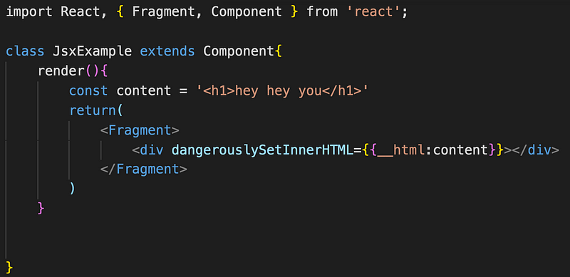

React 利用 JSX 語法來開發，類似 XML 的寫法，可以將 UI 介面跟程式邏輯跟緊密的結合（在 html 中使用 JavaScript 語法），一般的瀏覽器是看不懂 JSX 的，就需要 babel 來轉化成一般的 JavaScript，如果經過 babel 編譯就會發現 JSX 被轉為 React.createElement，所以 JSX 比較像是語法糖的概念。

//JSX 的寫法

<h1>Hello World</h1>;

//React.createElement 的寫法  
React.createElement(“h1”, null, “Hello World”);

JSX 看起來是不是簡單多了！？

#### **根節點**

這邊要特別注意，如同 vue 的 template 一樣，都是需要一個根節點，像下面這樣沒有一個根節點 dom 包住是會報錯的。

貼心提醒你是否要用 Fragment

用 Fragment 的好處就是不會額外增加不必要的 dom 節點

import React, {Component, Fragment} from 'react';

return (

   <Fragment>

     {this.state.order}

   </Fragment>

)

<Fragment> </Fragment>也可以縮寫寫成<> </>

html tag 需要有開始標籤和結束標籤，如果沒有結束標籤就要以 />結尾，JSX 習慣用（）包起來。

#### JavaScript 表達式

可以用大括號來放入動態的變數，大括號{}包起來的地方就可以寫 JavaScript 表達式，雖然不能寫 if else，但可以在裡面寫 function 三元運算式沒問題

#### 樣式的設置

style 的話可以傳入物件，不過 css 屬性都要變成駝峰式，個人是蠻不習慣的，fontSize 可以不寫 px。

如果直接寫 inlineStyle，很常少寫大括號，要記得是雙括號！

也可以另外寫一隻單獨的 css，再透過 class 來讀取樣式，這邊要注意的是 class 是 JavaScript 中的保留關鍵字，所以要用 className 取代，for 也是，需要用 htmlFor 取代。

在大括號裡面放入陣列，會自動展開！

結果如圖

#### 注入 html

可以利用 dangerouslySetInnerHTML 來帶入 html，相當於 innerHtml，注意這邊為兩個下底線 \_\_html:要傳入的 html

#### **如何引入圖片**

**requre 的方式**

不過這時候我把圖片丟在 public，結果就報錯了

字面上的意思就是請你要放在 src 底下才能拿到圖片，於是就在 src 底下新增一個 assets 資料夾放圖片，就成功了

**import 的方式**

import img from ‘./assets/su.jpeg’

然後在 JSX 的部分賦予 img 這個變數即可

以上就是針對 JSX 的簡單介紹！
