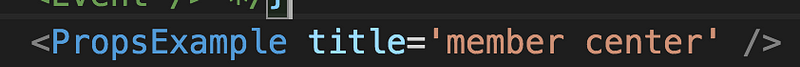

state 為自身 component 存放資料的地方，管理內部狀態，格式為一個物件，以 class component 來說，在建立自身的 component state 之前記得在 constructor 要先呼叫 super()，不然會取不到 this

如果沒執行 super ，就調用 this， 畫面會直接報錯提醒你

如果是 create react app 的話不需要寫 constructor 了，因為已經引用了@babel/plugin-proposal-class-properties 套件，可以直接寫 state，但因為練習的關係，接下來的範例還是會乖乖寫 constructor

這是省去 constructor 的寫法

class StateExample extends Component{

state = {

    count:0 //初始值

}  
}

利用 this.state.count 就可以取到值，用 setState 可以改變 state

**setState**傳入兩個參數 **，**第一個是**物件，**第二個是**callback function**

利用 setState 來改變原本的 state，記得要傳入的是一個物件，當 state 偵測到資料更動的時候就會觸發 render 讓畫面重新渲染。

如果我不用 setState ， 直接改 state 的值呢？你就會發現畫面一動也不動，因為 React 並不知道 state 已經被修改了，所以一定要用 setState

addCount = () => {

this.state.count++

}

另外，我在官網看到一個蠻有趣的例子，試著實作一下，點了按鈕後會連續觸發三次+1 的 function，預期應該會在畫面上看到 3 這個數字，結果，居然數字只有 1，原來會造成這樣的原因是 setState 是非同步的，如果要解決這樣的問題該怎麼做？

可以傳入一個更新用的 function 讓你可以取到當前 state，而非舊的 state

利用 setState 來完成雙向綁定，類似 vue 中的 v-model

#### **props**

> props 為子組件接受父組件的溝通管道，是唯獨的不可異動

父組件利用 title 屬性傳入值(字串

子組件用 props 取的上面傳下來的 title

假設我試圖想要從子組件改變 this.props.title

就會報錯了！告訴你這是個唯獨的值，因此想要改動的話，還是乖乖從父組件異動吧！或者將 setState 的方法透過 props 丟給子組件，讓子組件呼叫也是可以達成修改 props 的目的

另外再傳入 props 的時候，也可以順便定義一下型別，確保收到的 props 是正確的，`**React.PropTypes**`已經被棄用了，目前官網建議安裝 prop-types 來檢查型別

假設我故意傳數字進來，就會報錯了

另外還有一種寫法可以傳入各種元素進去，乍看還蠻像 vue 的 slot（雖然兩個功能不太一樣啦..

父組件的結構如下

就能將<PropsExample>標籤內的 html 當作 props 丟給子組件接收了

以上就是關於 State & props 的簡單介紹！
