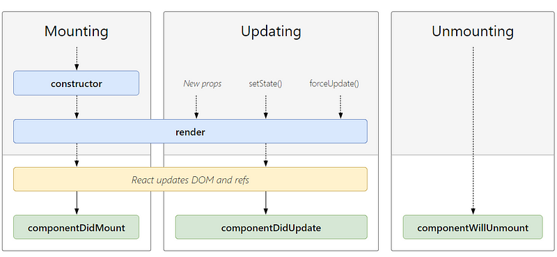
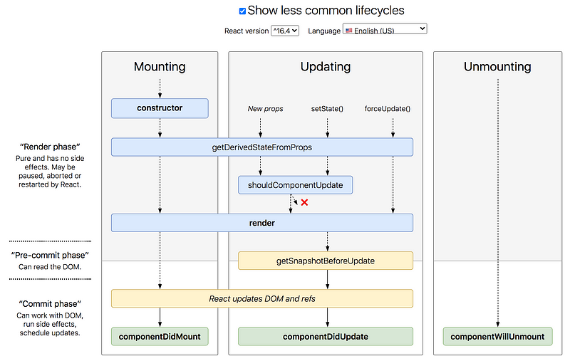

什麼是生命週期？就像人有生老病死，component 也有類似這樣的概念，了解生命週期可以讓我們知道如何在「對」的時間做「對」的事。

從官方提供的這張圖表，可以看出 react 生命週期的三大階段

- 創建 component (componentDidMount)
- 更新 component(componentDidUpdate)
- 銷毀 component (componentWillUnmount)

需要注意的是 class component 自帶生命週期，而 functional component 需要透過 react hook 才能擁有生命週期。

#### 生命週期的執行順序

**mounting 階段**

- constructor ：初始化
- static getDerivedStateFromProps
- componentWillMount（即將廢棄
- render ：渲染
- componentDidMount： DOM 掛載完成

**updating 階段**

- componentWillReceiveProps ：props 改變時才觸發（即將廢棄
- static getDerivedStateFromProps
- shouldComponentUpdate
- componentWillUpdate（即將廢棄
- render
- getSnapshotBeforeUpdate ：component 更新前執行
- componentDidUpdate ：component 已經更新完畢

**Unmount 銷毀**

- componentWillUnmount component 即將銷毀

以下針對較常用的生命週期來做介紹

- constructor :用來初始化的地方，還沒掛載到 DOM 的時候，假設沒有寫 super() ，就調用 this 的話會報錯
- render：必須實作的，回傳 JSX
- componentDidMount: DOM 已經掛載完成 ，在這個階段可以呼叫 api 來更新 DOM ，適合做一些初始化的工作
- componentDidUpdate: 當 props or state 更新 ，就會觸發組件更新 DOM，所以千萬不要在這個階段 setState，會造成無限循環
- componentWillUnmount: component 從 DOM 被移除 ，在這階段可以用來清除一些計時器

接下來介紹一些比較冷門的生命週期

勾選上面的 show less common lifecycle，就可以看到一些不常用的生命週期

- getDerivedStateFromProps()： 當 props、state 改變就會觸發，在初始化的時候也會觸發一次
- shouldComponentUpdate：讓你自己判斷是否要更新，如果回傳 false 這邊就不在往下執行 render， 所以這邊可以做一些效能的優化
- getSnapshotBeforeUpdate ：在更新 DOM 和 Refs 之前會觸發

**額外補充**

componentDidCatch() 錯誤邊界，個人覺得跟 try catch 概念有點像，捕捉子組件的錯誤，不因為錯誤而影響到父組件。

附上 react 開發者製作的[生命週期流程圖](https://projects.wojtekmaj.pl/react-lifecycle-methods-diagram/)，跟著流程圖跑一遍會比較容易理解生命週期的執行順序和觸發時機。
