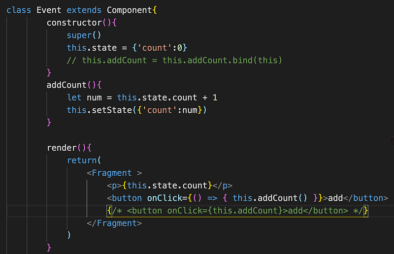

React 的 event 都是 camelCase 駝峰式命名， 跟以往的 HTML 小寫命名不同，並且事件一定要用大括號括起來

這是傳統的 HTML 寫法

<button onclick="handleEvent()">click me</button>

這是 React 的寫法

<button onClick="{handleEvent}">click me</button>

React 也封裝了一些已經定義好的事件類型 onChange,onFocus 等等….

React 根據 W3C 規範定義了 synthetic event，就可以透過 event target 取的被點擊的 DOM

handClick = (e) =>{

e.preventDefault()

}

如果傳參數的話 ，有兩種做法

1\. arrow function 需要將 event 傳遞下去

```
<button onClick={(e) => this.deleteRow(id, e)}>Delete</button>
```

2\. bind 則不用，會自動將所有參數都往下傳遞

```
<button onClick={this.deleteRow.bind(this, id)}>Delete</button>
```

接下來用一個簡單的計步器來示範 React event，按下 button 後數字會加一


一切看起來都很美好，用了駝峰式寫法也用了大括號，萬無一失！

結果按下 button 之後…


為什麼取不到 state 了？開始懷疑問題出在 this 身上，console.log（this)結果居然是 undefined，addCount 這個 function 的 this 指向並不在這個 React component 身上，就需要使用 bind 讓 addCount 可以正確綁定 React component


在 constructor 階段函式 bind(對象），等於將函式的 this 指向指定的對象(component 本人)

不過這樣寫，總覺得不是很方便，而且每多一個 function 就要多一行 bind，就可以利用 ES6 的 arrow function 來解決這個問題，箭頭函式的 this 就是指向自己本身，就不會有找不到 this 的問題了

雖然這樣的寫法解決了 this 的問題，但是每次 render 都會重新建立一個新的 callback function，數量一多也是會影響效能的



另一種寫法，直接將 addCount 改成 arrow function，這樣就可以解決 this 指向的問題


以上就是針對 React event 的基本介紹。
