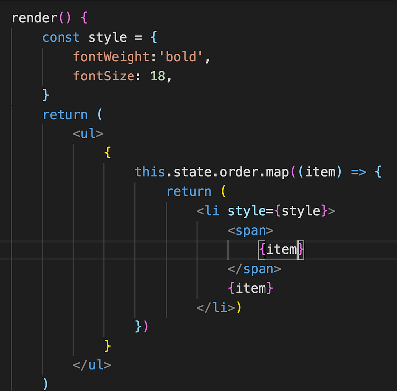

今天要來介紹在 React 裡面有哪幾種撰寫 css 的方式

#### 方法 1:inline-style：

這是我最不習慣的寫法，畢竟要用駝峰式的格式寫，就沒有樣式語法自動提示了(是有多懶，而且這樣寫不支援偽類選擇器：before :after 等等



#### 方法 2: 使用 sass/scss

yarn add node-sass

再引入即可

import './scss/test.scss'

#### 方法 3: css module

1.  css 檔名以 xxx.module.css 命名， 如果是 scss 就是 xxx.module.scss
2.  用 import 變數的方式引入樣式檔案
3.  className 傳入變數底下定義的 class


這是樣式檔案(_Title.module.scss)_

.main_title{ color:olive; }

有寫過 vue 的人應該知道，在.vue 檔案裡的 style 標籤加上 scoped 屬性就會具備 css module 的功能，那麼這樣的好處是什麼？a 和 b 檔案可以各自擁有同名的 class 而不會互相影響，這真的很重要！原理就是在編譯後會在 class 名稱上加上 hash 值，確保 class 唯一而不重複


那如果有一個情境是我想要這個 class 是全域的呢？可以利用:global 來達成

:global(.main_title){

color:olive;

}

引入的方式也要調整一下，不用傳物件，直接給字串即可

<h1 className ="main\_title">hello</h1>

另外有一個我覺得還挺有趣的功能，叫做 composes，功能有點像是 sass 的 mixin

這樣寫 main_title 就會吃到 title 設定的樣式了

_Title.module.scss_

.title{

font-style:italic;

}

.main_title{

composes:title;

color:steelblue;

}

另外 也可以將.scss 檔作為 composes

_other.scss_

.light{ opacity: 0.5; }

_Title.module.scss_

.main_title{

composes:light from './other.scss';

}

#### 方法 4: style components

說到 css in js，也就是用 js 來寫 css 就不得不提到 style components，被稱之為是 React 樣式處理的最佳方案！

yarn add styled-components

接著再引入

import styled from “styled-components”;

styled 後面可以放任何的 html tag， 定義完畢後就可以當成一般 component 使用，然後命名的第一個字一定要是大寫，不然會美丁美當。

styled.button\`\` 就等同於 style.button()，\`\`可以把它想成是 es6 的樣板語言會比較好理解


然後打開 f12 開發者工具看一下 html 結構，可以觀察到會自動生成亂數的 class，這是為了不要讓 class name 重複


我們可以利用三元運算式來根據 props 的變化改變樣式


也可以利用類似 scss 的巢狀寫法，設定子元素的樣式


這邊還提供了一個類似 scss extend 的功能，可以繼承現有 styled，再撰寫自己獨有的樣式，將 Content 的樣式傳入 Content2 的 styled()，如此一來 Content2 也會有 Content 的樣式


也可以利用 attr 屬性來傳入其他 html 屬性

```
const Email = styled.input.attrs({  type: 'email',})`  font-size: 20px;  border: 2px solid steelblue;`;
```

不過個人還是比較習慣 CSS Modules，將 js 和 css 分開處理，styled component s css in js 的做法還需要一點時間習慣。
