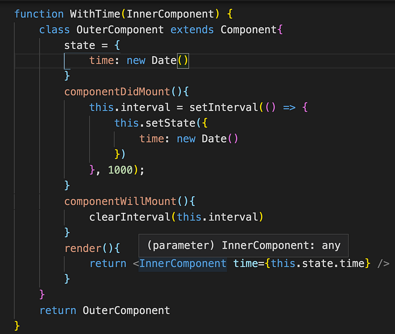
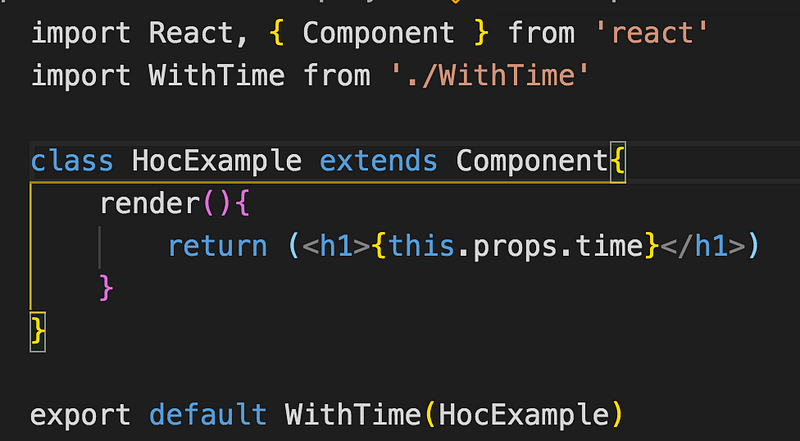
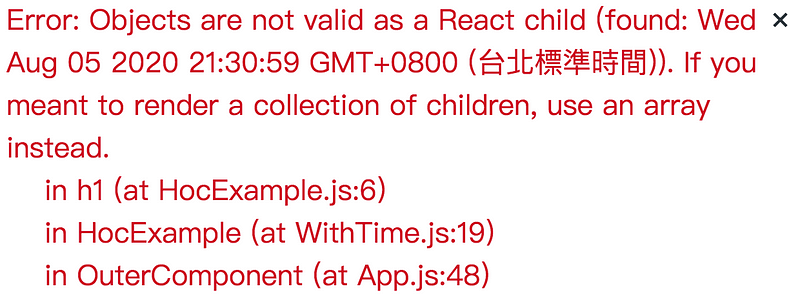
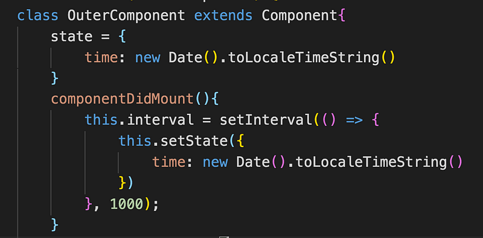
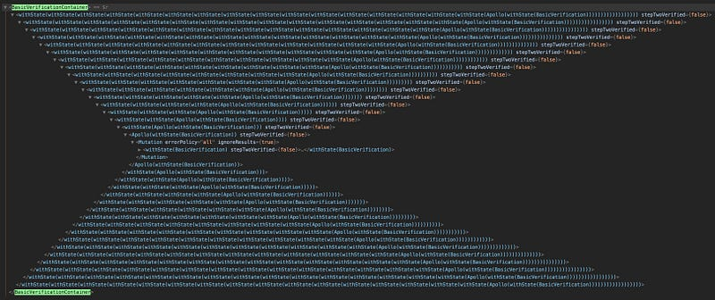

想必我們都曾經遇過一種情境，兩個 component 功能幾乎一模一樣，只是差在輸入的資料不同而已，那麼這時候就是 HOC 登場的時候了，HOC 為一個可以傳入 component 當參數的 function，其目的在於可以將重複的邏輯抽離出來，讓傳入的 component 可以套用這個邏輯，並且輸出一個全新的 component

當初看到 redux 的 connect 還想說這是什麼神秘的寫法，原來就是 HOC 啊!

const Counter = connect(

mapStateToProps,

mapDispatchToProps

)(Counters);

> 被作為參數的 component 稱之為**Wrapped Component**

以下就來實做一下 HOC，這是 HOC component，實現一個簡單的時鐘功能

可以看到 HOC component 接收到一個 component 之後，將計算後的結果（每秒更新當前時間）透過 props 傳遞到 wrapped component 裡面

這是要被傳入的 component(僅負責 ui，沒有邏輯處理），透過 props 取得 hoc component 輸入的資料，可以看到最後 export 出去的是 withTime 回傳的新 component

恩…又報錯了

字面上好像是我傳入了不合法的格式？一開始以為是不能傳時間物件？搞了老半天才發現，其實問題是在 render 的地方直接渲染物件， 將 state 轉換一下格式換成時間字串就可以了。

> toLocaleTimeString() 可以直接轉成當地時間字串

在估狗資料的時候一直看到 hoc 波動拳(hoc wrapper hell)，想說那是啥，看到下面那張圖就瞬間明白了什麼，因為 hoc 包 hoc，層層嵌套之下就會衍生這個問題，日後會再介紹 react hook 如何解決這個問題。

