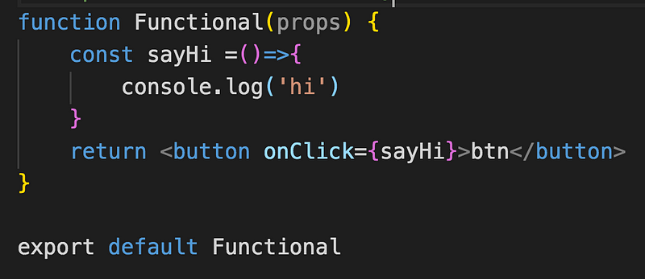
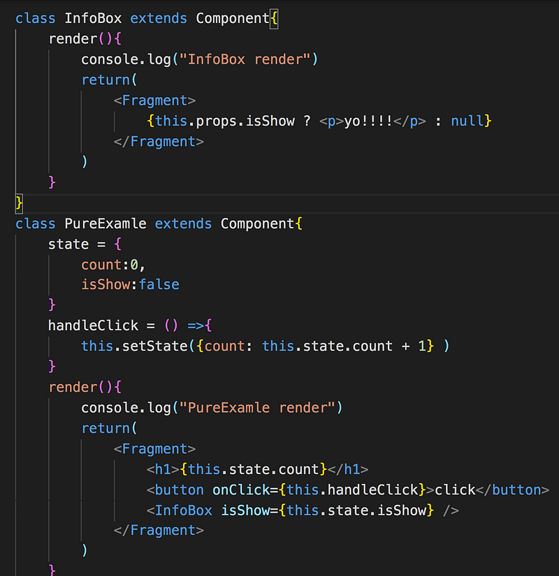
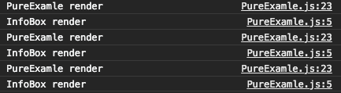

原本以為只有 class component 的寫法，但在看技術文章的時候發現還有一種寫法是 functional component，有了 react hook 之後，好像 functional component 就變成主流了（嗎）？

_那麼 class component 跟 functional component 差在哪裡？_

一個比較冗長一個比較簡單(誤

#### Class component

- 需繼承 React.Component
- 具有生命週期，可以針對某些情境決定是否渲染，ex shouldComponentUpdate()
- 具有 state (Stateful component)
- 需要實作 render 方法
- 擁有 this
- 每次都可以拿到最新的 this.props，因為 this 隨時都在變化，

#### Functional component

- 沒有生命週期 （React Hook userEffect 出現後，就有生命週期了！）
- 沒有 state（Stateless），所以被稱為無狀態組件（但 React Hook useState 出現後就可以有 state 了！）
- 可以用 arrow function 宣告或是一般的 function
- 沒有 this
- 編譯更快（因為不用將 class 轉換成 es5
- props 會一直是原本傳進來的那個，而不會跟著更新，閉包的概念

那麼在還沒出現 React Hook 之前，是什麼情境下會用到 Functional Component 呢？假設 Component 不需要紀錄狀態(state)，只是單純地處理一些 UI 繪製，就可以用 Functional Component

來試著簡單寫一個 Functional Component，但暫時不用 hooks（這部分後續會再介紹

也可以用 es6 的 arrow function 來寫，看起來更簡短了

而且 Functional Component 跟 Class Component 經過 babel 的編譯，轉換成 ES5 的程式碼的大小差距真的有讓我嚇一跳，查到一個數據是 100bytes v.s 1.2kb

有了 React Hooks 之後，Functional Component 也能擁有跟 Class Component 一樣的功能，而且更簡短的寫法可以少掉不少程式碼，可讀性也更高，讓 Functional Component 成為當前 React 開發的主流。

#### 關於 props 的差異

- class component 每次都可以拿到最新的 this.props，因為 this 隨時都在變化
- functional component 的 props 會一直是原本傳進來的那個，而不會跟著更新，閉包的概念

聽起來真的是蠻抽象的，推薦閱讀 redux 作者寫的[這篇文章](https://overreacted.io/how-are-function-components-different-from-classes/)，解釋的相當清楚

另外還有一種 component 叫做 pure component，範例如下，點擊 click 後數字會＋ 1

接者我點擊了三次加 1 的按鈕，恩？好像哪裡怪怪的？為什麼我修改 count，state 沒變，infobox 這個 component 也要跟著重新渲染？

這時就可以用 PureComponent 來避免不必要的渲染，引用 PureComponent 並且繼承 PureComponent

再看 console log 就會發現只會印出 PureExample render 了!

參考資料：[How Are Function Components Different from Classes?](https://overreacted.io/how-are-function-components-different-from-classes/)
