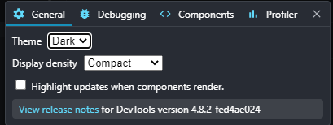

在沒有用過框架的 chrome 的除錯工具前，我其實不知道類似這樣的工具在開發上能夠有什麼幫助？不過經過實際使用一陣子之後， 才發現 dev tools 真的太好用了(雖然我用的是 vue tools， Debug 的時候很好用 ，可以看 state 當前的狀況是如何， 以最快的速度找到畫面上的物件對應是哪個 component 等等

#### React Developer Tools

先到 google 應用程式商店安裝

安裝成功後，瀏覽器右上角會出現 React 的 icon，這時發現擴充功能的 icon 是紅色的

如果是用 yarn start 就會是採用 development 模式， 滑鼠滑過去會跳出一個小小的方塊

> This page is using the development build of React.

> Note that the development build is not suitable for production.

> Make sure to [use the production build](https://facebook.github.io/react/docs/optimizing-performance.html#use-the-production-build) before deployment.

> Open the developer tools, and the React tab will appear to the right.

大意是說要用 production 模式才能使用擴充功能，所以我先執行了 yarn build 之後再執行

yarn global add serve  
serve -s build

終於成功...

先將專案 build 起來， 再 serve 的概念，這裡真的讓我困惑許久，vue dev tools 是 mode development 才能使用 ，production 反而不行，React 居然是相反的 這樣我開發到一半想用 dev tool 工具看一下 props 甚麼的好像辦不到  …

還是有甚麼方法可以是 production 方法 ，但又有 hot reload(即時更新)的功能，恩…目前我是估狗不到就是了

打開 f12 就可以看到 Components 和 Profiler 的頁籤了

> 畫面上的 redux 是要另外安裝的

**Components**

左邊為 component 結構 ，右邊會有一些 props 、hooks 的數據，source 的部分我覺得很貼心 ，直接跟你說對應的 js 是哪一支

左上角那個箭頭 icon 點選之後，在頁面上可以到處摸(? ，就會展開對應的 component 方便查看

頁面上被選中的元件會有反灰的效果

點開搜尋框旁邊的齒輪可以做一些設定，調整顏色主題

如果想看 html 的結構(目前都只能看到 component) ，可以打開齒輪 把隱藏 html tag 關閉

#### Profiler

profiler 可以查看所有 component 的渲染時間， 結果一打開就說 profiiling not supported…

本來以為是 React 版本過舊 ，但升級之後還是不行， 點選面板上的網址依照指示執行

yarn build --profile

就可以了！ 點選左上角的藍色圓點 (Start profiling)進行錄製，這邊的操作跟 chrome performance 其實蠻類似的

在錄製的期間 ，隨意地對畫面進行操作 ，完成錄製後再按下 stop， 就會看到以下畫面， 因為我的 component 的結構沒有很複雜 ，所以繪製出來的火焰圖只有兩層

點選類似長條圖的區塊就會顯示對應的渲染時間 ，長條圖如果為黃色而且比較長的話就代表渲染時間較長

如果在該階段 component 沒有被渲染就會顯示 Did not render during this profiling session

**Redux DevTool**

主要的功能就是在追蹤 Redux 的資料變化， 列出有哪些 action 等等

state 的結構還可以選擇不同的方式呈現 ，圖表化看起來真的很炫!

有了 dev tool， 讓你開發事半功倍!
