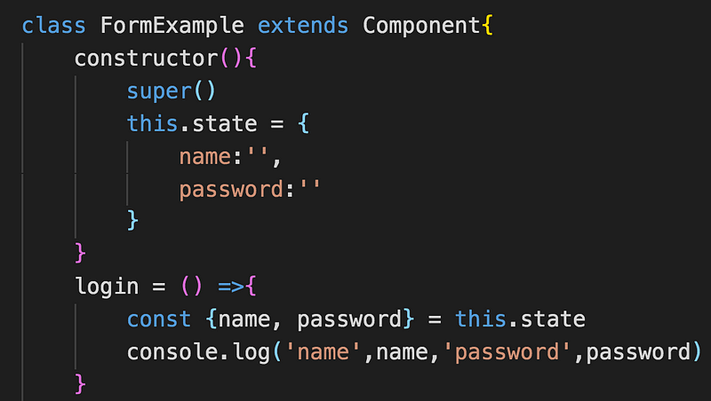
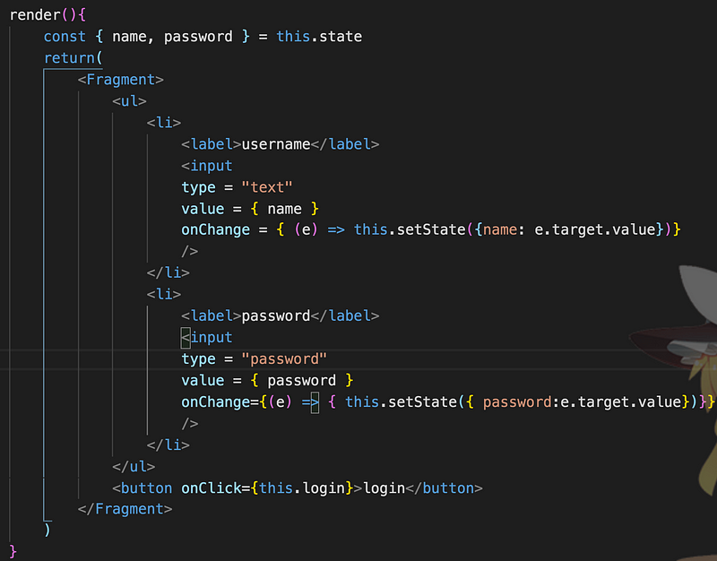
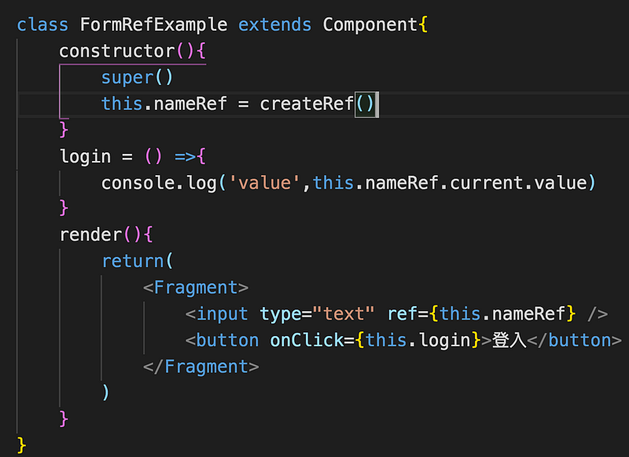

在練習表單處理這塊，如果在不依賴套件的狀況下，可以有兩種方式來控制表單欄位，那麼今天就來介紹一下 controlled component 和 uncontrolled component

兩者之間的最大的差異就在於 component state 是否由 React 控制

- controlled component:指的是透過 useState 來保存資料，setState 來設置表單
- uncontrolled component: 指的是 input 並沒有綁定 state，單純透過 ref 來取值 ，跟傳統作法一樣

> 兩者都可以達到取值的目的

以下為一個簡單的登入表單

先用 state 存放帳號和密碼，然後透過將 state 的值賦予 input，當用戶輸入資料的時候就會觸發 onChange function ，呼叫 setState 來更新欄位資料，類似 vue 的 vue-model 雙向綁定的概念

以下是用 createRef 來取得 input 本身，再利用 current.value 取的 input 的 value 操作表單 ，跟傳統的 document.getElementsByTagName(“input”)\[0\].value 來取值的概念是一樣的

看來看去 ，好像第二種寫法 uncontrolled component 更簡單不是嗎?但是當需要控制的 DOM 數量一多， 需要大量手動的去操作 DOM 作業量就變得更繁重， 而 controlled component 是由資料數據來更動畫面，雖然一開始的資料綁定流程比較繁瑣，但綁定完畢之後只要專注在資料處理即可，所以儘可能地使用 controlled component 吧！
