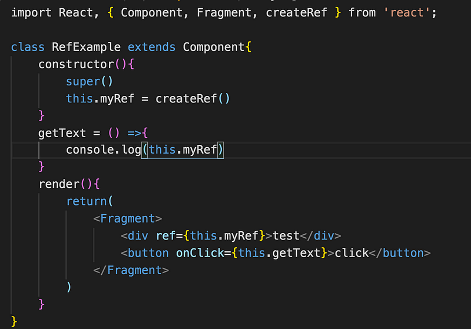
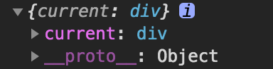
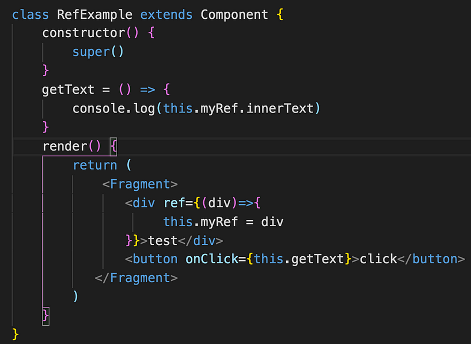
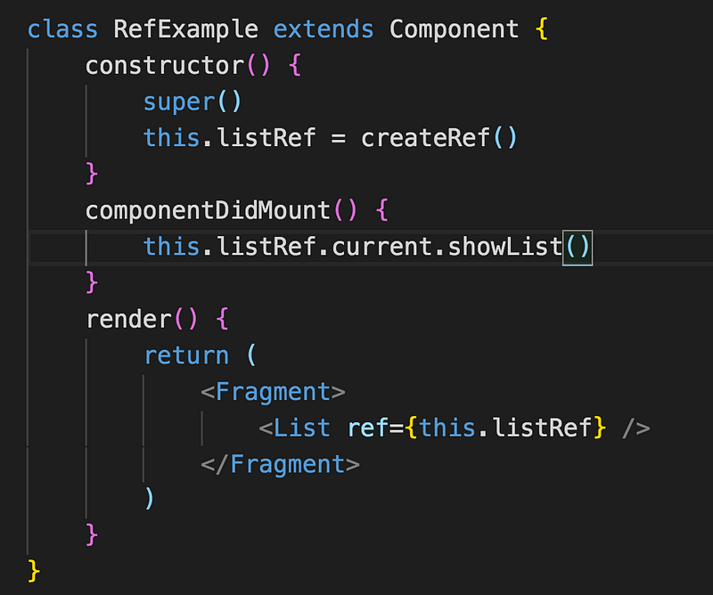

以前我們要抓一個 DOM 的時候很習慣用 document.getElementById、document.getElementsByClassName 等等的語法來取得我們要的 DOM 元素，但假設在 react 中要取得 DOM 可以怎麼做？就可以利用 React.createRef()，這是 react v16.3 開始用的語法，更舊的版本是採用 CallBack Ref 的方法。

什麼情境下需要用到 Ref ？

- 觸發即時動畫
- 與第三方 DOM 函式庫整合。
- 管理 focus、選擇文字、或影音播放。

React 官網也提到不要過度使用 Ref，應該先思考是否能單純用 state 來解決問題，因為當專案越來越複雜，理想狀況是用 State 和 Props 控管組件，但如果使用了很多 Ref，在管理 DOM 上就會變得不好維護，像是一個簡單的彈窗，開關的方法應該由父組件透過 props 傳給子組件，而不是用 Ref 來控制 component

#### React.createRef()

在 createRef()的 instance 創建出來時，就會同時被紀錄在組件的變數上（myRef），並且將需要被參考的對象指定 Ref 屬性，如此一來就可以在整個 component 裡被取得。

console.log(this.myRef)，會發現 myRef 底下還多一層 current，因此我們要取得 DOM 就要透過 this.myRef.current

**Ref callback**

可以看到 Ref 屬性代入的是一個 callback function，將自身的 html tag 傳入，並讓 myRef 這個變數指向當前這個 div

_要注意的是不能在 function component 上使用\_Ref _，因為他們沒有 instance\_

React component 也可以用 Ref

