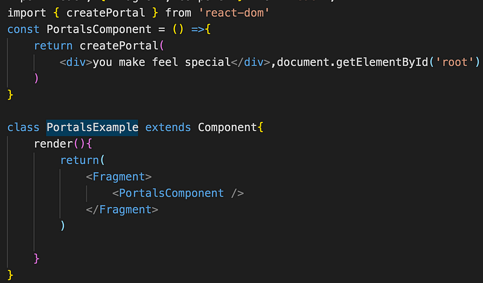
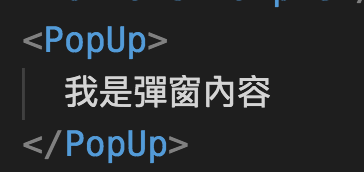
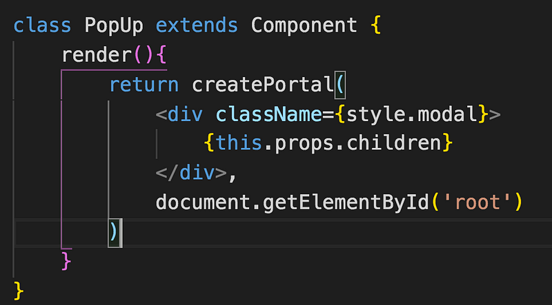

Portal 為插槽功能，可以將子元件渲染到父元件以外的地方，聽起來很炫，概念感覺有點像任意門？render 一個 component 時，其實改變的是另一個地方的 DOM，通常會用到的情境是要跳脫父元件的限制，像是 z-index、overflow:hidden 等等。

比如你的 root 元件裡有三個 component，header、content、 footer，但是彈窗組件是位在 content，那麼彈窗顯示的時候，要怎樣才能覆蓋滿版的畫面？用 css 硬幹或許行得通，但絕對不是好方法

**ReacDom.createPortal(child, container)**

- child 是要插入的 React Dom ，ex. jsx 等等
- container 是要插入的位置，已經存在的 DOM 元素

以下面的例子來說
you make me feel special
就是 child，container 就是在最外層 id 為 root 的 DOM

簡單的彈窗範例

在<PopUp></PopUp>之間帶入彈窗的內容

PopUp component 透過 this.props.children 拿到外部傳入的彈窗內容

#### Portal 的事件冒泡 (Event Bubbling)

點擊了 portal，同時也會將事件往上傳，所以點擊了 modal 也會觸發 open function

  
   <modal>du du du </modal>  

以上就是關於 React Portal 的簡單介紹
