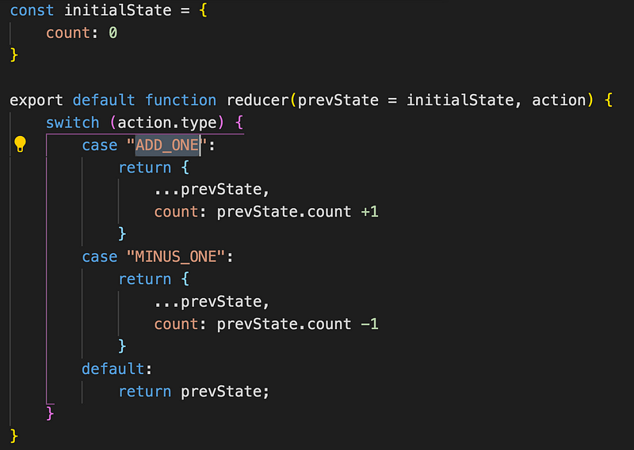
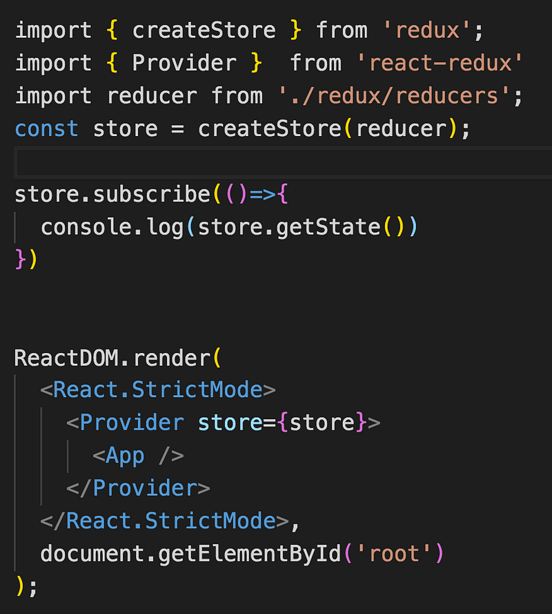
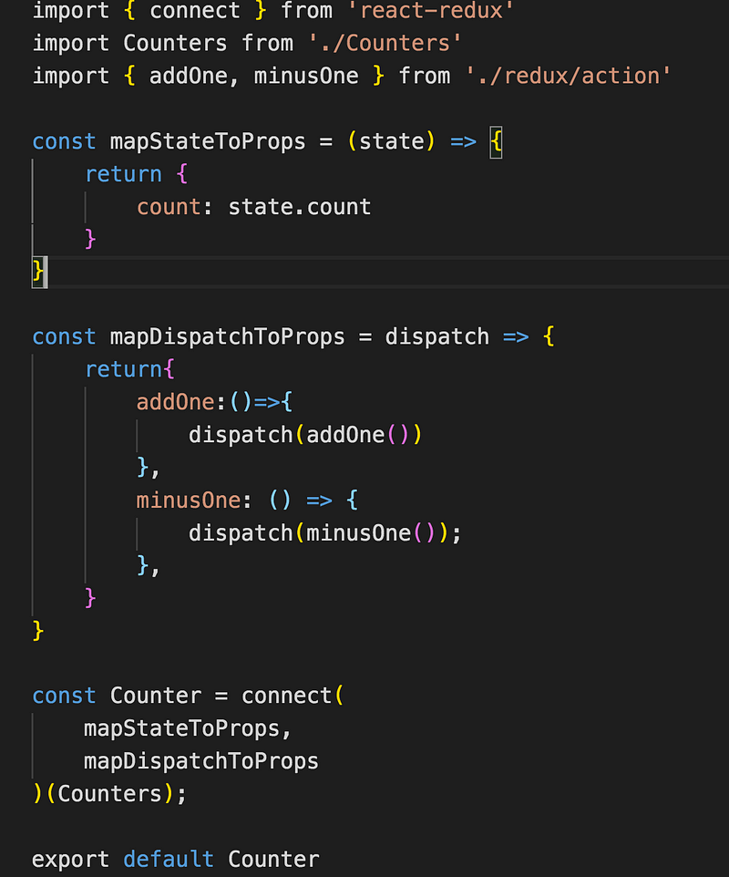
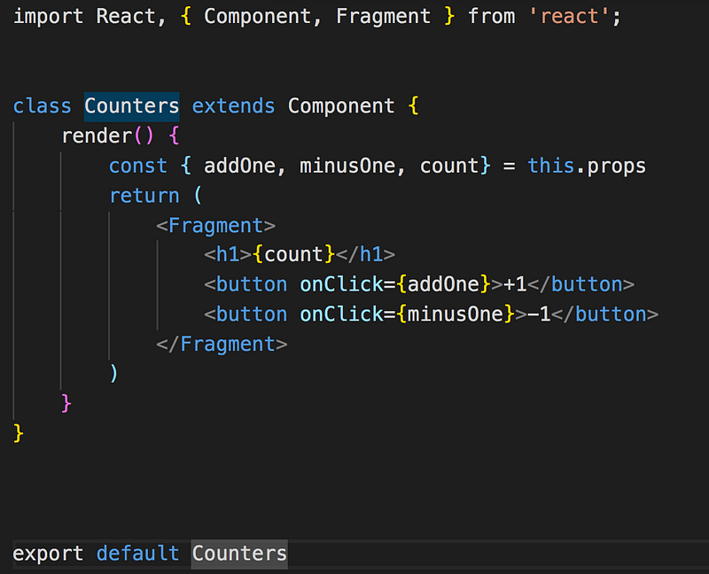

寫過 vue 就知道有 vue 有提供 vuex 來做資料(state)的集中管理，那麼 React 呢?就是藉由 Redux 來達成，不過讓我有點訝異的應該是 React 跟 Redux 沒有關係，我以為 Redux 和 React 的關係就像 vue 和 vuex 一樣(殊不知完全不是)!

在找資料的過程中比對目前的官網文件，其實看得有點痛苦，一下子 import React-Redux，一下子 import Redux，這兩個難道是不一樣的東西嗎，花了一點時間才理解，原來 React-Redux 是 React 與 Redux 的橋樑

#### 什麼是 Redux？

> Redux 一個用於應用程式狀態管理的開源 JavaScript 庫。Redux 經常與 React 搭配運用，但其也可以獨立使用 （來自維基百科的解釋

先來認識四個重要的名詞

- state: 儲存資料地方
- action :描述動作（通常是大寫，有點像定義常數那樣，定義這個動作的名稱
- reducer :根據 action 定義的動作並實作具體的功能（將原先的 state 作資料異動
- dispatch :觸發 action 的指令，進而觸發 Reducer 更新資料

首先，先安裝 Redux 和 React-Redux

```
npm install redux react-redux
```

reducer 會有兩個參數， 第一個為初始狀態的 state ，即 initalState，第二個則是傳入 action

接下來根據傳入的 action 的類型，對資料做不同的操作（對當前數字做加減），記得一定要在 default 回傳原值，才能處理那些沒被定義的 action type



創建完 reducer 後要在 index.js 引入 createStore ，並且傳入 reducer，假設我有多個 reducer 呢？那就可以引用 redux 提供的 combineReducers 方法來整合多個 reducer，再一口氣傳入全部 reducer

React 透過 provider 接收傳入的 store ，可以讓所有的子組件透過 props 都拿到 state，每個專案都應該只有一個 store

在 index.js 建立一個 provider ，並且包住<App/>



對於完全沒有寫過 React Redux 的人，直接看官方的 tutorial 應該是有看沒有懂，建議先看過[阮一峰的介紹](https://www.ruanyifeng.com/blog/2016/09/redux_tutorial_part_three_react-redux.html)(英文苦手推薦)或是把官方的 API Reference 讀一遍，才能比較理解各個 api 的用途

connect 的概念是將 Redux 與 UI 組件結合，Redux 負責資料處理，UI 組件只要單純根據輸入的資料做畫面渲染即可，這邊有運用的 HOC(High order component)的概念，傳入 mapStateToProps、mapDispatchToProps，以及原先寫好的 class component(Counters)後，會加上一些方法後回傳一個全新的物件

這是 Counter.js



connect 共有 4 個參數，但我看大部分的情境只會用到前面兩個，所以後面兩個參數就不介紹了

**function** **connect**(mapStateToProps?, mapDispatchToProps?, mergeProps?, options?)

#### mapStateToProps

將 store 的 state 對應成 props state，日後如果 state 有更新，那麼 mapStateToProps 也會跟著改變

#### mapDispatchToProps

將 store 的 dispatch 對應成為 props dispatch，假設 connect 沒有傳入，預設會帶入 dispatch

這是被傳入的 Counters component，透過 props 拿到剛剛 connect 帶入的 mapStateToProps 與 mapDispatchToProps，此時點擊按鈕就能成功修改遠在天邊的 initialState.count



之前問有學過 React 的朋友，他們覺得最難理解的是那一個部分？大部分都回 Redux，的確是名不虛傳 XD
