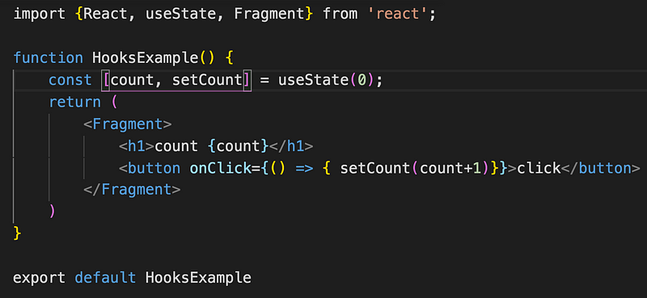
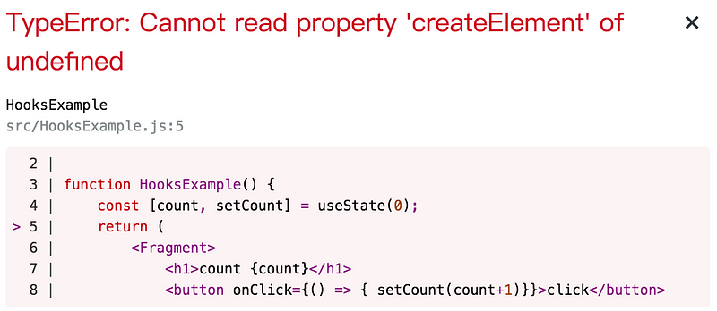
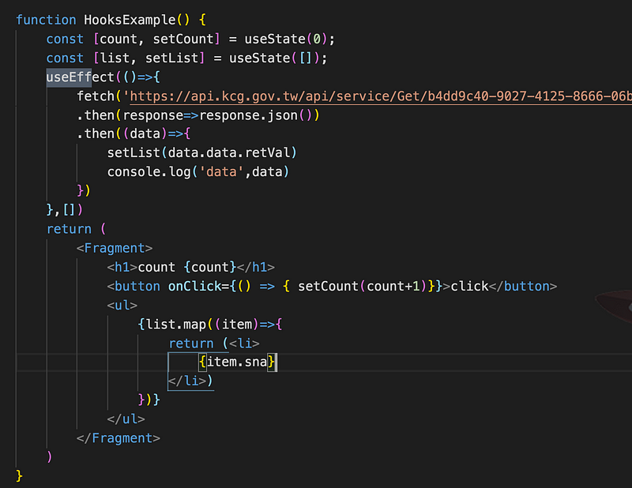
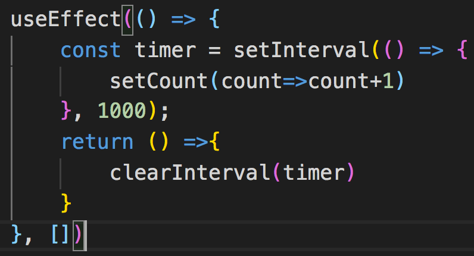

當 functional component 遇上 React Hooks，就好像白雪公主遇到她的王子…（我想不到更好的比喻了）有了 Hooks，讓 functional component 也能擁有自己的 state 、lifecycle，而且寫法也比原本的 class component 更加簡化

> React Hooks 的方法都以 use 開頭，也可以自己定義 Hooks，至於為什麼要叫做 Hooks? —  需要用到的時候，透過鉤子 Hooks 將功能勾進來使用

### useState

能夠讓 functional component 建立自己的 state，useState 裡面傳入的是 state 的初始值，然後會回傳一個陣列，透過解構拿到 state 的當前值以及更新 state 的 setState 方法，可以在 functional component 建立多個 useState！跟之前 class component setState 比起來，個人比較喜歡這種寫法，每次更新值都是針對當前的值，而不是一個對 state 物件裡的屬性操作，較為單純。

useState 也可以傳入函式，但必須回傳值

const \[count, setCount\] = useState(()=> return 0})

點擊按鈕數字就會自動加 1

此時發生一點小插曲，存檔之後，想看一下畫面發現報錯了！

反覆看了程式碼真的一頭霧水，只好求救 google 大神，才發現我的 React 不小心包在大括號裡面， 因為 React 預設為 export default，所以一定要放在大括號外面，明明已經寫過很多遍，但是恍神的時候還是有可能寫錯，而且一時半刻找不出問題在哪裡 orz

import React, {useState, Fragment} from 'react';

### useEffect

useEffect 用來處理副作用（side effect) ，什麼是副作用?就要先了解 pure function

_什麼是 pure function?_

> 一個 funciton 輸入相同的參數，會輸出相同的結果，以 React 來說就是給予相同的 props，會渲染出相同的畫面

_什麼是副作用（Side Effect）？_

> 任何與 function 回傳值沒有相關的操作，像是 ajax 請求、監聽事件、手動修改 DOM 等等，可能會造成預期之外的影響

透過監聽 state、 props 的變化，來決定要不要更新 ，可以說是生命週期 componentDidMount、componentDidUpdate、componentWillUnmount 的集合版，會接受兩個參數，第一個參數是非同步的操作的函式，有點像是 callback function 的概念，在 component 進到哪個週期需要執行的動作

第二個參數為一個陣列，是給 useEffect 判斷要不要執行函式的變數，如果這個參數有更動才會執行 function，第二個參數如果放一個空陣列，等同於是 componentDidMount，如果放的不是空陣列，初始渲染會執行一次，陣列裡面的資料有異動會在執行一次(componentDidUpdate)。

userEffect(()=>{  
//初始渲染執行一次，資料有變化再更新一次等於 componentDidUpdate  
},\[data\])

下面的例子是在 componentDidMount 階段呼叫 api 取得資料，然後再渲染到頁面上

假如第二個參數什麼都沒傳，就會變成每次渲染都會觸發，可能會發生無窮迴圈的問題

useEffect 也可以回傳一個 clean up 的函式來執行 component 銷毀前要做的事情，像是清除計時器、取消 api 請求等等，等同於 componentWillUnmount

可以同時使用多個 useEffect 沒問題，接下來會繼續介紹 useContext、useRedux
