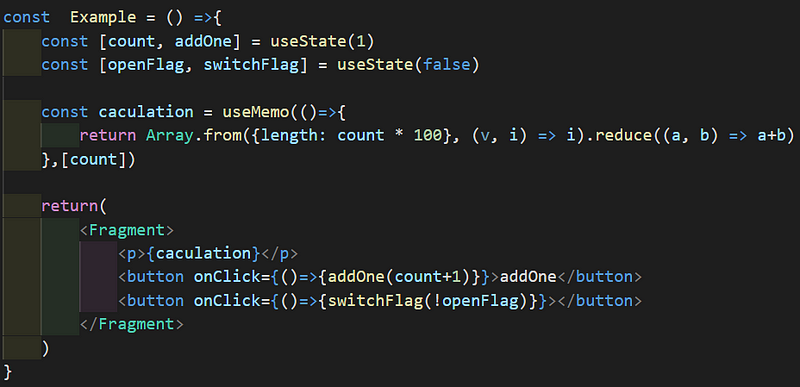
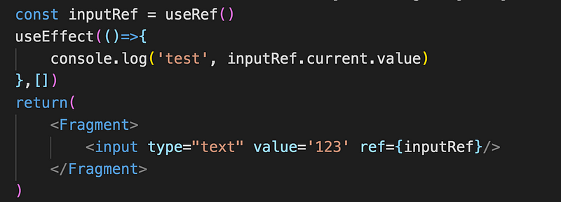
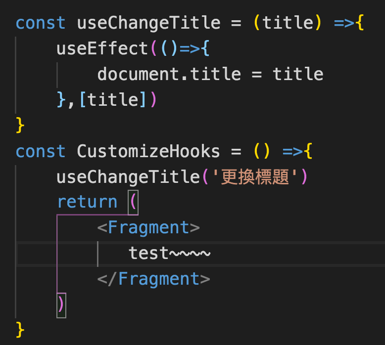

在搜尋 useMemo 的時候，就一直看到 React.memo 的相關資料 ，雖然 React memo 不屬於 React hook 的一部分，但還是簡單介紹一下，我們都知道 class component 有 shouldComponentUpdate 可以來決定 component 是否要重新渲染，那 functional component 也有類似的功能嗎？有的那就是 React.memo，React.memo 為 react v16.6 引入的新功能，同時他也是個 Higher order component(HOC)。

#### **React.memo**

當 functional component 的 state 和 prop state 有變化的時候，React.memo 就會檢查之前的 state 、props 是否與當前的相等，如果 props 沒變動就不會重新渲染

第一個參數是把 component 傳入 React.memo 裡面，假設需要控制比對過程就可以傳入第二個參數`areEqual function，來自定義比較prop的function與shouldComponentUpdate()不同的是，如果props沒變，則是return true就不會重新re-render`

const banner = React.memo(component, `areEqual`);

const banner = React.memo(({title }) => 
{title}
, (prevProps, nextProps =>{return false});

#### useMemo

當 component 結構變得複雜時，頻繁的 re-render 就會造成效能上的問題，useMemo 適用於減少的重複的複雜計算 ，像是資料量較大的 map、filter 操作等等，但假設是輕量的資料處理就不建議使用，反而浪費效能。

usememo 的使用需要傳入兩個參數

const test = useMemo(callbalck, array)

- callback:做計算處理的函式
- array :當陣列改變時才會做重新計算， 如果沒有寫這個陣列，那麼每次渲染都會重新計算 ，如果放入空陣列 ，那麼效果就會跟 useEffect 類似 ，只會在初始渲染一次。

以下面的例子來說，count 隨著數字增加，運算也會變得更加重，可以看到 caculation 會先依據創建一個長度為 count\*100 的陣列，然後再將裡面的 index 加總起來

假如只是更改 openflag 的布林值， 也會造成 caculation 重新計算，但 caculation 的值並沒有變化，這樣就會造成多餘的計算，就需要由 useMemo 來決定是否需要渲染

#### useCallback

useCallback 乍看之下跟 useMemo 差不多

const test = useCallback(callbalck,array)  
也等於  
const test = useMemo(()=> callback, array)

但 useCallback 回傳的是 callback function 本身

假如這個函式為 props 會往下傳給子 component ，如果 function 頻繁的變動連帶也會造成底下的子 component 無意義的 re-render，但貌似用的機會不多…

大致而言 useMemo 是暫存計算的值 ，useCallBack 是暫存函式的使用

#### useRef

useRef 可以讓我們取到指定的 DOM，用一個 inputRef 變數將 useRef（）存起來，大部分的例子都會寫 useRef（null）將初始值設定為 null，但實際測試發現沒寫也不會怎樣，useRef 還是有作用的，接下來在要綁定的對象上，透過 ref 屬性，將物件傳入

利用.currernt 屬性可以取到 DOM 對象，所以透過 inputRef.current.value 就可以成功取得 input 的值 123

#### 自定義 Hooks

利用現有的 React Hooks 封裝成自己設定的 Hooks ，下面是一個更換網頁 document title 的 Hook

#### React Hooks 帶來什麼好處？

- 代碼簡短很多，有了 Hooks，用 functional component 也可以擁有 class component 的功能，而且語法更加簡單！
- 程式碼變得更少
- 解決 HOC hell (層層牽套的結構）
- 處理副作用的問題
- 封裝功能可以將重複組件抽離出來
- 不需要引用其他管理狀態的套件 ex.Redux
