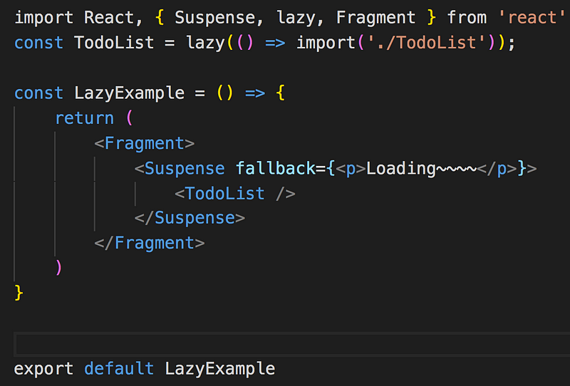
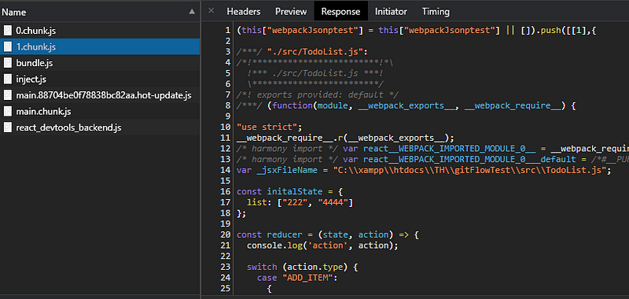
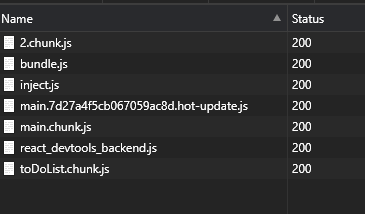

在 build 專案的時候，我們會透過 webpack 將不同模組的 component 打包成同一支 js，但是當專案的規模越來越大， 程式碼的 size 就會逐漸肥大，好幾 mb 都有可能，載入的時間也會拉長， 影響使用者體驗，而且並非所有的程式碼的功能會在一開始就使用到， 所以透過 React lazy 可以將程式碼拆分成不同的區塊延遲載入 ，優先載入比較重要的 js， 再載入次要的 js， 就不需要一口氣載入全部的程式碼了！

_React Suspense & React Lazy 為 16.6 的版本才有的功能_

> React lazy 和 React suspense 還沒有辦法在 SSR(server-side)使用 ，如果有程式碼切割的需求就必須使用 Loadable Components

根據官網的描述， 如果你的專案適用以下這三種方式建立的， 那麼已經有 webpack 的設定

- CRA (create react app)
- Next js
- Gatsby

#### Lazy

動態載入 js，可以將程式碼分割，需要用到時再用 import 載入

#### Suspense

延遲載入 component 會被 suspense 包覆 ，假如 component 還沒載入完成， 就能夠透過 fallback 顯示一些提示訊息，必須搭配 Lazy 使用，如果只有寫 Lazy 沒有 Suspense 的話就會報錯，另外，Suspense 可以包覆多個 lazy component

以下的例子是動態載入 ToDoList

可以利用 google dev tools ，利用 network 來模擬網速慢的狀況 ，網速選 slow 3G，就能夠看到在載入 ToDoList 之前看到 loading 的字樣。

觀察 network 載入的檔案，會發現多了一個 1.chunk.js ，其實也就是 ToDoList

但如果延遲載入的 js 很多，這樣的命名方式就不太好辨識哪個 js 檔案對應的是哪一個模組，可以再加上註解 webpackChunkName，這樣切割出來 bundle 的檔名就會依照註解的名稱命名

const TodoList = lazy(() => import(/\* webpackChunkName: "toDoList" \*/'./TodoList'));

可以看到原本的 1.chunk.js 變成 toDoList.chunk.js

如果有一些不常用到的功能就可以被切割出來，畢竟在這個分秒必爭的時代，加速網頁載入速度是很重要的優化項目，或許你會想問現在大家都網路速度都很快，有差一點那麼一點時間嗎？答案是肯定的，因為你無法確定所有人的網路環境都很好，以我自身在租屋處的例子，網路忽快忽慢，慢的時候隨便打開一個網頁都要等個三十秒，更何況是 js 檔案很肥大的網頁，真的是考驗人的耐性，所以減少網頁載入的時間絕對是有必要的。
