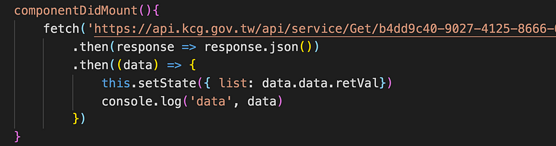
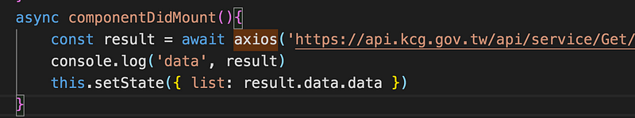
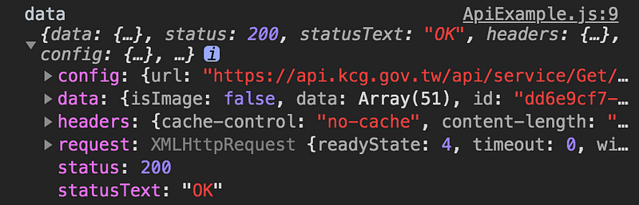
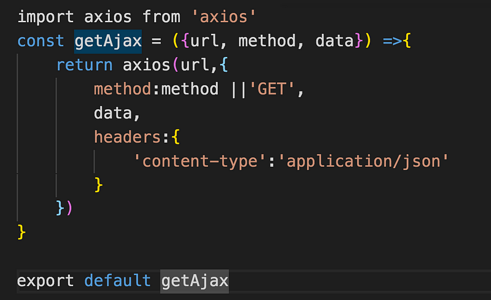
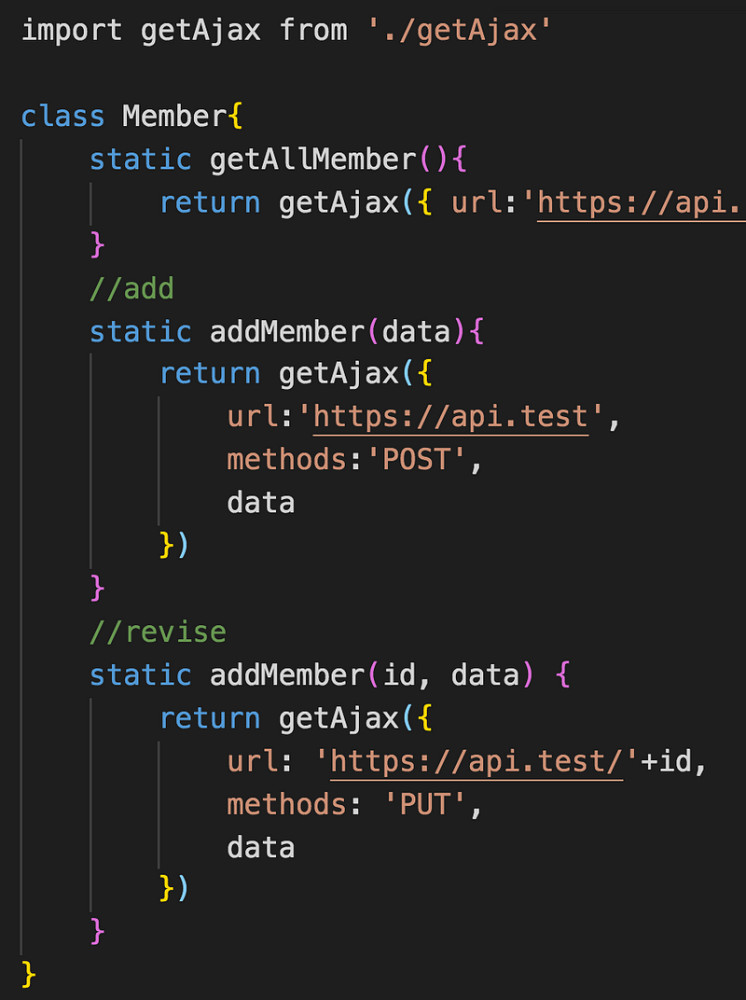

剛開始工作的時候是 jQuery 的時代 ，用$.ajax 來接 api 得心應手， 偶爾接觸到不能用 jQuery 的專案， 就用原生的 XMLHttpRequest 來處理， 隨著時間演變 ，串接 api 的方式有了更多的選擇， 接下來就會介紹 fetch 和 axios

#### fetch

fetch 是基於 ES6 promise 的 api 請求方法， 比起原生的 XMLHttpRequest 寫法簡化了不少 ，預設請求方法為 get，會回傳 promise 物件 ，可以使用.then()來接續後續的處理

這是利用 fetch 來呼叫 API ，透過 then 拿到 reponse 之後，利用 json()方法將拿到的資料轉換成 js 物件，但這樣寫還是有點繁瑣的，那麼來試試看 axios 吧！

#### axios

目前工作的專案就是 vue 搭配 axios ，可以說是目前主流的 api 套件

axios 的好處

- 自動轉換 JSON
- 使用 ES6 Promise
- 可以在 node.js 發送 http 請求
- 能夠取消請求

> 瀏覽器如果不支援 promise 需要先安裝 polyfill

安裝 axios

yarn add axios

記得先 import 套件

import axios from 'axios'

axios 會回傳一個物件， 裡面會有 api status 、headers 等資訊， 可以透過 data 來取得回傳的資料， 剛好要取得的陣列的 key 也是 data

因為回傳的是 promise 物件，所以可以搭配 async 和 await 來處理，console.log （data）的結果如下 ，可以用 data.data 來取的陣列，除了 data 之外，promise 物件還提供了 status 狀態碼等資訊

這樣的呼叫方式 ，看起來簡單很多 ，但還是沒有很理想， 每支 api 還是需要寫上 api domain， 比較大型的專案就會用到很多 api，然後通常根據功能的不同，api domain 也會不一樣，如果今天要調整 api domain 就要尋找四散在各地 call api function ，會非常吐血，維護上變得非常不便，所以在實務上我們會封裝成一個工具，可以傳入 url、method、data 等等

所以通常會將 call api function 拉成共用的 function

然後將呼叫的 api 定義好，就可以輕鬆呼叫 api 了，下面的範例是定義會員中心部分的 api 功能（新增、修改等等），更理想的 axios api 管理方式可以參考 mike 大大的文章

[使用 axios 時你的 api 都怎麼管理](https://medium.com/i-am-mike/%E4%BD%BF%E7%94%A8axios%E6%99%82%E4%BD%A0%E7%9A%84api%E9%83%BD%E6%80%8E%E9%BA%BC%E7%AE%A1%E7%90%86-557d88365619)

封裝過後，就可以用更簡易的方式來呼叫 api，也更方便管理和維護！
