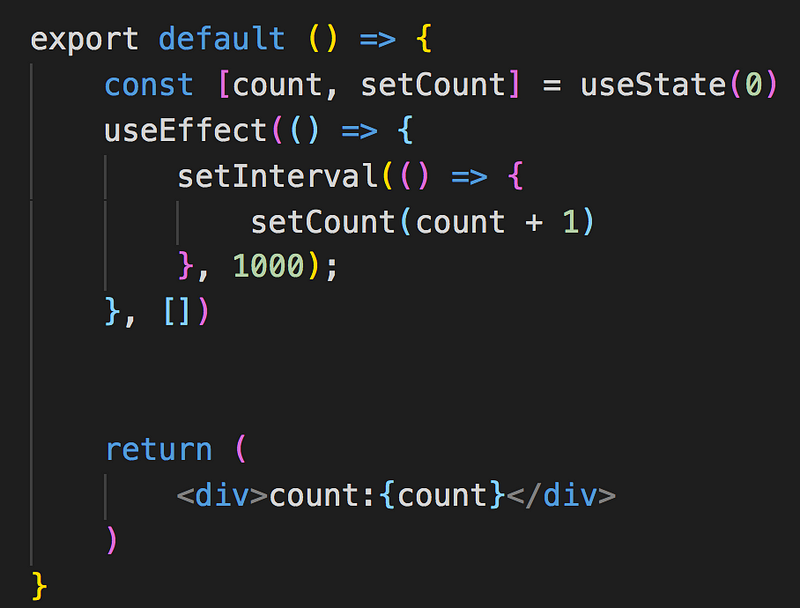
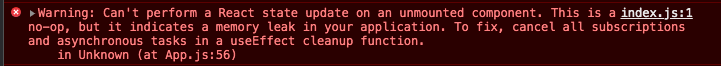

memory leak 字面上翻譯就叫做記憶體洩漏，記憶體洩漏會造成什麼問題？大家應該有那種經驗，開太多 chrome 分頁，電腦開始卡卡的，嚴重點直接當掉，memory leaky 的概念類似這樣，程式在運作的時候會佔用記憶體，沒有用到的記憶體如果沒被即時釋放，記憶體佔用就會越來越高，然後你的程式就會崩潰了！

在了解 memory leak 之前，先來認識 javasScript 的垃圾回收機制（garbage collection），在記憶體沒有被用到的時候應該要被釋放，但在下面幾種情境下就會造成記憶體洩漏

1.全域變數：未經宣告，name 會變成全域變數，就不會被回收掉

function test(){ name="bill" }

2.閉包: 匿名 function 可以拿到父層作用域的變數值，導致變數無法被回收

function parent(){var count =0 return function(){console.log('count'+count)}}

3.計時器 setInterval 、setTimeout 等等沒使用時，如果未清除還是會持續佔用記憶體，所以應該使用 clearInterval 以及 clearTimeout 來清除計時器

3.計時器:即使 copy 這個 dom 被移除了，但是對 dom 的參考一直都在，所以計時器持續執行就無法將 copy 回收（即將刪除

setInterval(() => {  
 const btn = document.getElementById('copy');  
 btn.innerHTML = varible + 1  
}, 1000);

4.DOM 被移除時，監聽事件未被移除(部分老舊瀏覽器

document.getElementById('copy').addEventListener('click',copyFunction)

const target=document.getElementById('copy')  
target.parentNode.removeChild(target);

如果有用到計時器但沒有在 component 銷毀的時候，一併清除計時器的話就會造成記憶體洩漏的問題，然後如果你有很多個計時器的話，瀏覽器應該會崩潰

為了展示計時器忘記清除的狀況下造成的記憶體洩漏問題，寫了一個計時器每秒會自動加一，剛好遇到一個問題，那就是我的數字永遠都停在 1，以為 setInterval 只會執行一遍，但如果看 console.log，會發現其實每秒都在執行，只是 count 永遠都是 1

為什麼會這樣？因為 setInterval 取到的 count 是最初始的 0，是的，這是閉包的陷阱，如果要解決這個問題可以在 setState 傳入一個 function，count=>count+1，該函式就可以取得最新的 count

useEffect(() => {

setInterval(() => {

     setCount(count=>count+1)

}, 1000);

}, \[\])

或者將 count 傳入 useEffect，當 count 變化時就會觸發 useEffect

useEffect(() => {

setInterval(() => {

     setCount(count + 1)

}, 1000);

}, \[count\])

當計時器終於正常運作的時候，我在外部 component 寫了一個判斷，三秒過後變數 show 會變成 false，此時就會銷毀計時器 component

{show ? <MemoryLeak /> :null}

三秒過後會發現計時器消失了的同時，也出現了這樣的錯誤，看到關鍵字 **memory leak**

要解決這樣的問題，就要記得在 useeffect 內回傳 clean up 函式，就會在 component 銷毀時清除計時器

還有兩種比較常見的**memory leak**

1.  假設寫了 setTimeout 設定五秒後 setState，但 component 在五秒之前就已經銷毀了，此時五秒一到執行 setState 就會造成 memory leak

2\. 有個情境是 call 拿到資料後 setState，如果用了非同步請求，在 api 比較慢的狀況下，response 還沒回來時，component 被銷毀後 response 才回來觸發了 setState ，造成 memory leak

> 會造成 react memory leak 通常就是在已經銷毀的 component 上進行 setState

#### 解決的**memory leak 方法**

**解決 settimeout、setinterval 造成的 memory leak**

- class component 務必在 componentWillUnmount 階段移除計時器
- function component 要記得在 useEffect 裡面 return 清除計時器的 function

**解決非同步造成的 memory leak**

- class component 在 constructor 裡宣告一個變數為 false，在 componentDidMount 階段設為 true，接著在 api 請求回來那邊多加一個判斷，如果變數非 true(代表 component 已經銷毀)，就 return 中斷(如果有更好的做法歡迎告知)
- function component 在 useEffect 裡傳入 clean up 函式， 當 component 銷毀時就取消請求
