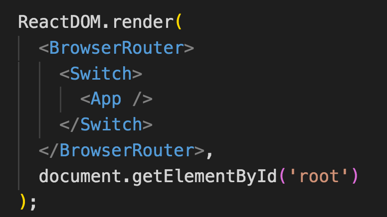
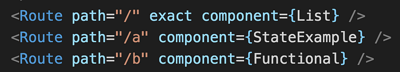
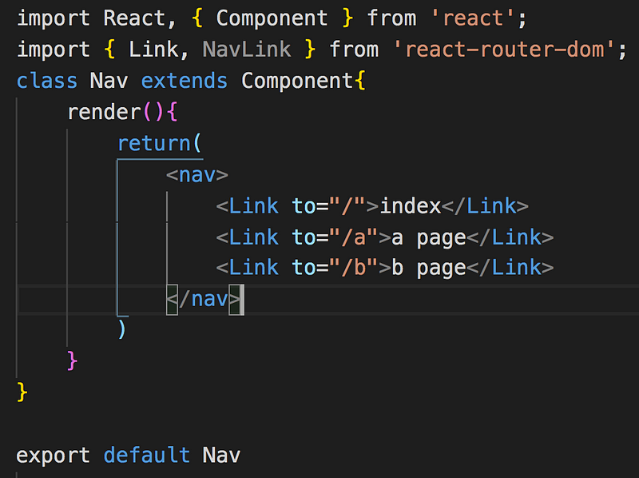
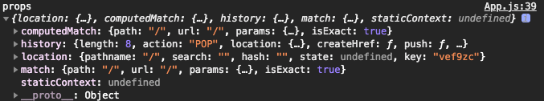

以往在同個網站切換網頁的時候，就會重新刷新頁面，然後等待資源重新載入才能看到新的畫面，但是人的耐心是有限的，每次的切換如果都需要等待的話，耐心就會被消磨殆盡， 使用者體驗就會變的很糟糕，因此 SPA(single page application)單頁式應用的出現就是為了解決這個問題，切換頁面不會重新刷新，有效提升使用者體驗

React 是靠 react-router 來實作，然後爬文一下發現，怎麼有 r**eact-router**和 r**eact-router-dom**？簡單介紹兩者的差異如下

- react-router:具有 switch route router 等方法 ，但無法透過操作 DOM 來跳轉
- react-router-dom :是以 react-router 為核心，提供 BrowserRouter 、Route Link 等等 ，可以用操作 DOM 的方式來改變 path

所以實際上我們只要引入 react-router-dom 即可來實作 react-router 的功能

首先安裝 react-router-dom

npm install react-router-dom

在 index.js 引入

import { BrowserRouter, Switch } from 'react-router-dom';

BrowserRouter 的用途：讓其底下所有的 component 都能使用 router，可以利用 HTML5 History 來進行操作

Switch 的用途：讓第一個吻合 url 的 component 被渲染，如果沒有 switch，所有吻合的 component 都會被渲染

接著將用 BrowserRouter、Switch 將 app component 包起來



#### Route

先引入 Route，並且在 app.js 裡的 jsx 設定 Route

import { Route } from 'react-router-dom';

Route 的用途：幫路由設定對應的路徑和元件，可以說是用來定義哪個路徑配對哪個元件



Route 有幾個屬性如下:

- exact:路徑需要完全符合才會導到該頁面等，等同於 path===pathname，沒加的話點擊就造成 /、/a、/b 均吻合路徑
- path:路徑，用來比對 URL
- component:路徑吻合後，顯示對應的 component

假如 Route 沒有寫 path 或是 path=’\*’， 並且排在前面的 Route 都沒被吻合的話就會被渲染，所以就可以拿來放一個預設頁面（404 not found）

<Route path="\*">  
    <NoMatch404 />  
</Route>

路徑的部分抽離出來放在 nav.js 控管



#### Link

import {Link} from 'react-router-dom';

設定完 Route 之後，就要搭配 Link 來設定路徑，可以想像成是 a 連結的功能，只是點擊後不會重新跳轉

> to 可以接受字串或是物件(location object)

字串

<link to="http://test.com" />

物件

```
<Link to{{  pathname: '/product',  search: '?sort=asc',  hash: '#hash',  state: { isMemeber: true }}} />
```

#### NavLink

透過`activeClassName="active" ，`來設定與當前 URL 吻合時的項目要套用 active 樣式 ，可以想成是進階版的 link

<NavLink activeClassName="active" to="/b">b page</NavLink>

**BrowserRouter 與 HashRouter 的差異？**

**BrowserRouter** 網頁路徑 [http://test.com/a](http://test.com/a)，需搭配 server 設定（ex apache、nginx），因為實際上並沒有 a 這個 html 檔案，所以不管使用者輸入什麼路徑都要導至 index.html 再交由 react router 控制

> 利用 HTML5 history API 提供的 pushState 、popState 方法來控制路徑

**HashRouter** 網頁路徑會有＃， ex.[http://test.com/](http://test.com/a)#b

利用 window.location.hash 、hashchange 控制路徑，透過改變#後面的值來切換頁面

但我是用 BrowserRouter，居然也可以正常運作？那是因為 create-react-app 自動建立了 express server 的緣故，目前看到用 React 製作的網頁大部分都是使用 BrowserRouter 模式，畢竟網址當中多了個#看起來還是不太美觀

**withRouter**

**withRouter**為一個 HOC component，能將 location、 history 等資訊 作為 props 傳入 component，一般而言只有包在 Route 裡面的 component 才能拿到路由的資訊，如果是麵包屑 component(沒有被包在 Route 裡面)需要取得 router 的資訊就可以透過 withRouter

import {withRouter} from 'react-router-dom'  
function App(props){  
 console.log('props',props);  
 return (<div className='app'></div>)  
}  
export default withRouter(App); // 透過 WithRouter 將 router 等資訊傳入

印出 props，可以看到有 history、location，match 等資訊



#### Redirect

如同字面上的意思，用來重新導向，不會改變原有的網址

`<Redirect to="/intro" />`

參考資料

[https://reactrouter.com/web/example/basic](https://reactrouter.com/web/example/basic)
