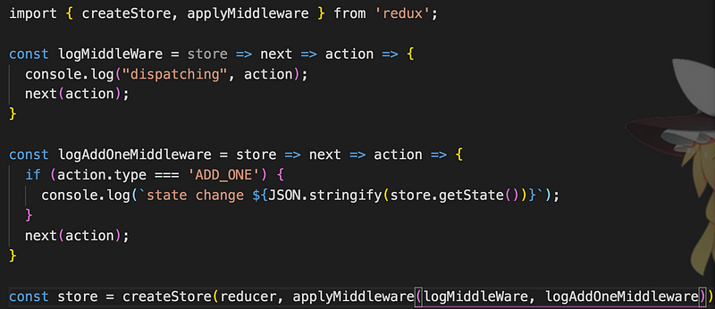
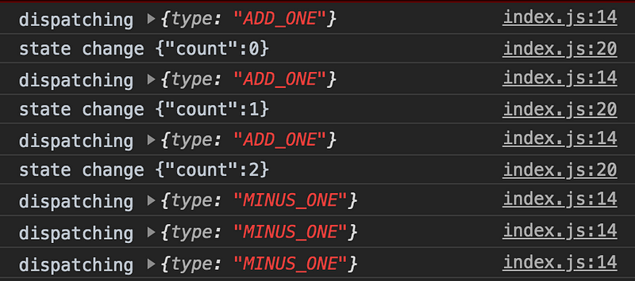
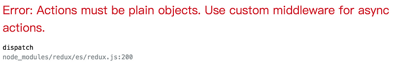

Redux Middleware 翻成中介軟體，在 dispatch action 之後到執行 reducer 之間，可以執行多個 middleware，就像接力賽一樣將 action 交棒給 middleware，再交棒給下一個 middleware，最後才觸發 reducer

在 middleware 階段可以觀察是哪個 action 觸發以及 state 的變化紀錄，也可以在這裡處理非同步的問題，因為 redux 本身無法處理非同步的 action，像是 dispatch 一個 action 是 call api 這類的行為

首先要先引入 applyMiddleware

import { applyMiddleware } from 'redux'

第一次看到這樣寫覺得很神奇，其實就是呼叫一個函式會再回傳一個函式 ES6 Arrow Function 的寫法

const logMiddleWare = store => next => action => {

console.log("dispatching", action);

next(action);

}

換成一般的 function 寫法就會是這樣，有波動拳的既視感

function logMiddleWare(store)  
 function wrapDispatchLog(dispatch) {  
 return function(action) {  
 dispatch(action)  
 }  
 }  
}

以下就是一個簡易版的 Middleware，將定義好的 middleware 傳入 redux 提供的 applyMiddleware，再傳入 createStore()

logMiddleWare 為第一個 middleware ， 透過 store 拿到 action 後 ，再呼叫 next 方法將 action 往下交棒給第二個 middleware logAddOneMiddleware ，最後觸發 reducer

就會看到在更動資料前，會印出 action 以及變動前的 state

以上就是 Redux Middleware 的基本概念

下一篇會介紹 redux thunk 來如何解決 aciton 非同步的問題

